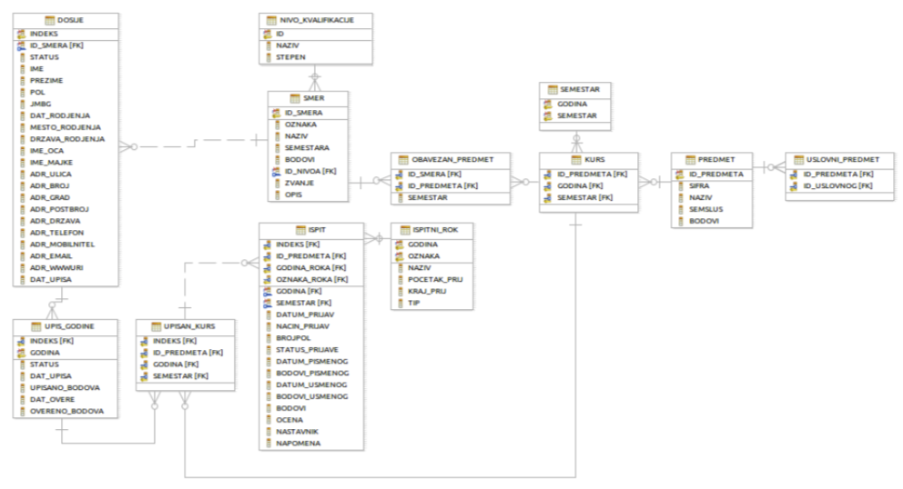
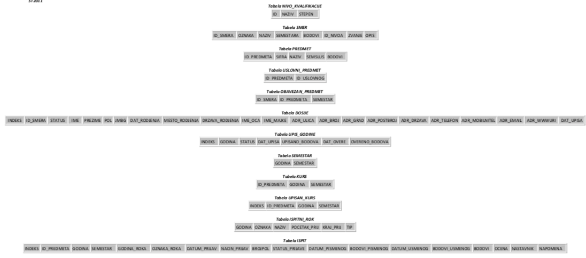




name: sadrzaj

# Sadržaj

- [Uvod](#uvod)
- [Zadaci za danas](#danas)

---
name: uvod 
class: center, middle, inverse

# Uvod
#### novi model

---
layout: true

.section[[Uvod](#sadrzaj)]

---

## Uvod

.message.is-warning[
.message-header[
Info
]
.message-body[
- <a target="_blank" rel="noopener noreferrer" href="../db/tabele.sire.nova.zip"> ☛ `Nova šema baze podataka`</a>

]
]

)

---

## Uvod 

.message.is-warning[
.message-header[
Info
]
.message-body[
- <a target="_blank" rel="noopener noreferrer" href="../db/tabele.sire.nova.zip"> ☛ `Nova šema baze podataka`</a>
  

]
]

---

name: danas 
class: center, middle, inverse
layout: false

# Zadaci za danas

---
layout: true

.section[[Zadaci za danas](#sadrzaj)]

---

## Prvi deo

.message.is-info[
.message-header[
Zadatak
]
.message-body[
- Primer 1: 
    - Ispisati sva muška imena koja postoje među studentima, prebrojati ih i urediti prema zastupljenosti.
- Primer 2: 
    - Za svakog studenta ispisati njegov indeks, ime i prezime spojene u jednoj koloni i broj položenih bodova.
- Primer 3: 
    -  Pronaći poslednji položeni ispit za svakog studenta. Izdvojiti indeks studenta i datum polaganja poslednjeg ispita.
- Primer 4: 
    - Za svaki smer na osnovnim akademskim studijama izdvojiti obavezne predmete i, ako imaju, njihove uslovne predmete. Izdvojiti naziv smera, naziv obaveznog predmeta i naziv uslovnog predmeta.
]
]
            

---

## Drugi deo

.message.is-info[
.message-header[
Zadatak
]
.message-body[
- Primer 5: 
    - Za svaki smer pronaći studenta koj je položio najveći broj bodova na smeru. 
    - Izdvojiti naziv smera, indeks, ime i prezime studenta i broj položenih bodova.
- Primer 6: 
    - Za svakog studenta smera Informatika na osnovnim akademskim studijama, koji je fakultet upisao 2007. godine, pronaći koje obavezne predmete nije položio. 
    - Izdvojiti ime i prezime studeta i naziv predmeta.
- Primer 7: 
    - Za svakog studenta smera Informatika na osnovnim akademskim studijama, koji je fakultet upisao 2007. godine, pronaći za koje nepoložene obavezne predmete nije položio uslovne predmete. 
    - Izdvojiti ime i prezime studeta i naziv predmeta.
]
]

---
## Treći deo

.message.is-info[
.message-header[
Zadatak
]
.message-body[

- Primer 8: 
    - Pronaći predmete koji su obavezni za sve studije na nekom nivou. Izdvojiti naziv nivoa kvalifikacija i naziv predmeta
- Primer 9: 
  - Odrediti prolaznost po predmetima. 
  - Izdvojiti naziv predmeta i procenat studenata koji je položio taj predmet u odnosu na broj koji su ga polagali.
- Primer 10: 
  -  Izdvojiti parove studenata koji su na istom smeru i rođeni su istog dana. Izdvojiti naziv smera, datum rođenja, indekse, imena i prezimena studenata.
]
]

---

layout: false

## Korišćeni materijal

- Katedra za računarstvo i informatiku, Matematički fakultet, Univerzitet u Beogradu

---

class: center, middle, theend
layout: false
background-image: url(/../theend.gif)

