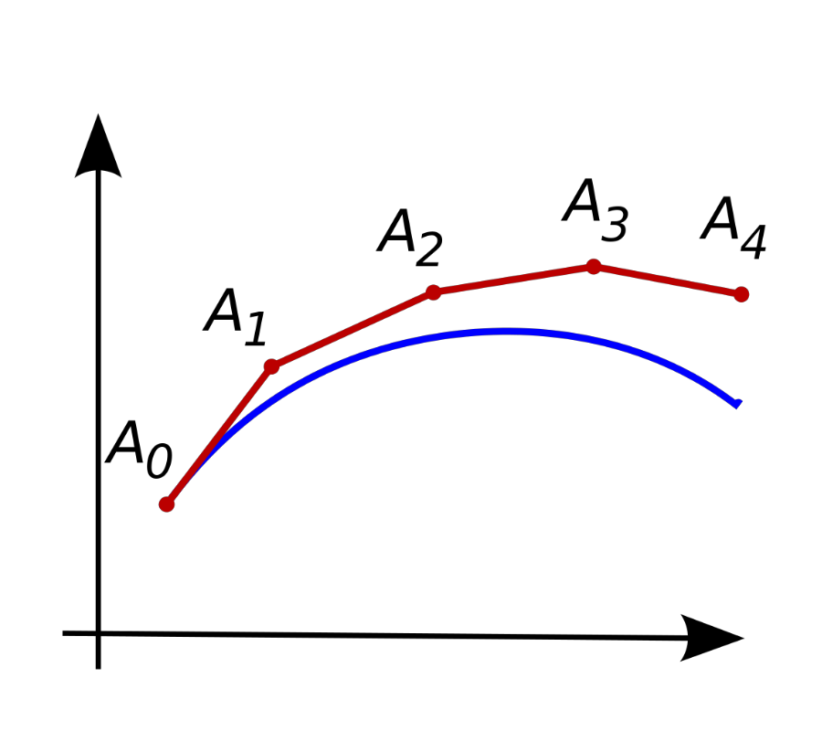
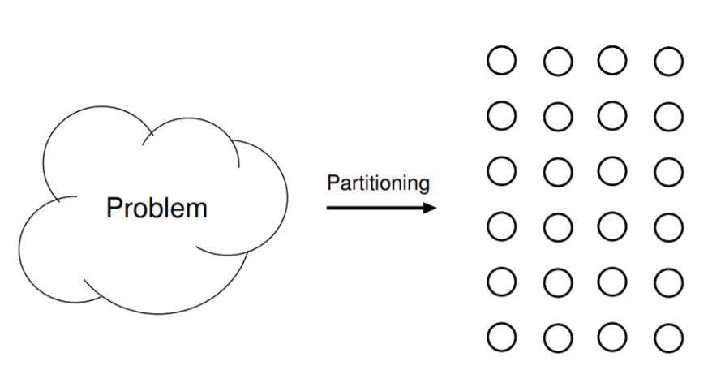
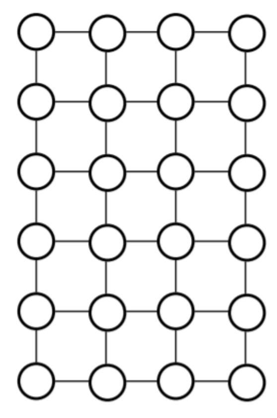
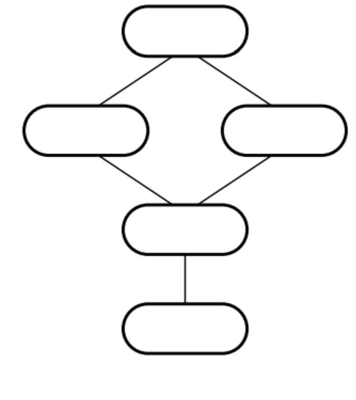
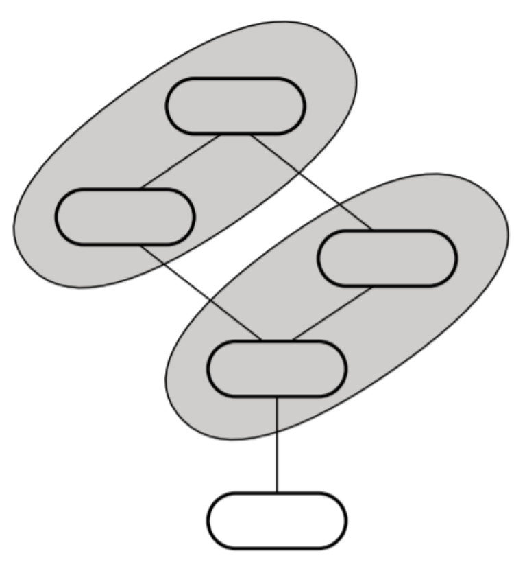




class: center, middle

# Zašto koristimo `HPC`? 

#### tipični problemi `HPC`-a

---
layout: true

.section[[Domen problema](#sadrzaj)]

---

## `HPC` kao priznanje neuspeha

- Na jedan veoma stvaran način, `HPC` je znak da smo se predali.
- Reformulacija problema nije radila.
- Lukavi algoritmi nisu radili.
- Sve što nam je ostalo jeste da napadnemo problem sa mnogo više resursa nego što je to normalno dostupno.
- `HPC` je, tako, zadnja linija odbrane kada se rešava nekakav problem.

---

## `HPC` i ekonomija

- `HPC` je takođe ograničen neočekivanim ekonomskim faktorima.
- Vi možete lični računar namestiti da radi šta god želite: ako hoćete da uposlite 100% CPU-a generišući svetove kroz Dwarf Fortress niko se neće buniti. U najgorem slušaju trošite malo dodatne struje.
- `HPC` klasteri i super-računari su drugačiji: ozbiljne instalacije imaju troškove izvršavanja koji znače da se svaki minut mora naplaćivati.
- Stoga `HPC` se uglavnom koristi ili za projekte koje su interesantni vladama ili velikim kompanijama.

---

## Neke popularne primene

- Kriptanaliza
- Naučna simulacija
    - Simulacija fluida
    - Simulacija plazme
    - Simulacija klime
    - Seizmološki modeli
- Statistička analiza ogromnih skupova podataka
- Problemi mašinskog učenja

---

## Ograničenje kursa

- Ovde mi prelazimo ove primene samo ovlaš zato što, fundamentalno, svrha za koju se `HPC` primenjuje nije odgovornost `HPC` inženjera. To je odgovornost domenskog eksperta. `HPC` se bavi time da su resursi za proračun dostupni.
- Kao deo ovog kursa od vas će se tražiti da napišete seminarski rad o nekoj primeni zato što je zgodno da znate, makar okvirno, kako izgleda pravi problem ne bi li bili sposobniji da projektujete rešenja koja taj problem i njemu slične rešavaju.

---

## Kriptanaliza

- Prvobitna primena računara (te i, po definicji, `HPC`-a).
- Cela svrha kriptografije jeste da ne ostavi nikakav brz način da se do podataka dođe bez nekog ključnog elementa (ključa, tipično).
- Kriptanaliza, idealno, razbije algoritam za enkripciju tako da to ne važi.
- Danas su kriptografi mnogo veštiji nego nekada i potpuno razbijeni algoritmi su retki. Alternativa jeste da se postigne parcijalno oslabljivanje gde se količina nagađanja i proračuna smanji donekle tako da (možda?) dođe u domet najbržih super-računara.
- Možete biti sigurni da negde u podrumima `NSA` zuje računari koji se bave baš ovim poslom.

---

## Kriptanaliza—mogući problem

- Istražiti algoritam tipa opšteg sita polja brojeva (*general number field sieve—GNFS*) i koristiti ga za faktorisanje poluprostih brojeva.
    - Poluprost (*semiprime*) je broj sa dva ne-trivijalna prosta faktora, npr. 2701 koji je 37 * 73.
- Ovo se onda lako može koristiti za razbijanje `RSA` enkripcije, tj. za ekstrakciju privatnog ključa iz javnog ključa.
- `GNFS` referentna implementacija je: https://sourceforge.net/projects/msieve/

---

## Naučna simulacija

- Posmatrano sa veoma visokog nivoa apstrakcije, naučne simulacije su tipično (mada ne nužno) simulacije nekakvog fizičkog sistema koji je takav da je nemoguće dobiti rešenje zatvorene forme no je neophodno raditi aproksimaciju i diskretizaciju.
- Recimo u komputacionoj dinamici fluida prostor se deli na komade (ćelije) i specijalizovana verzija Navier-Stokes jednačina se rešava za svaki taj komad u svakom kvantu vremena formirajući rezultat.

---

## Primer naučne simulacije—Problem n tela

- Problem `n`-tela je jedan od najpoznatijih i definitivno najstarijih problema u matematičkoj fizici.
- Imaju razne pod-formulacije koje sve objedinjuje sistem od n tela koji interaguju pod nekakvom silom no mi se ovde fokusiramo na vrlo jednostavnu, Njutnovsku verziju:
- Ako imamo `n` tela sa masama `m0…n` i pozicijama `r0….n` koje variraju u odnosu na vreme `t`, kako će ta tela da se ponašaju pod efektom gravitacije.
- (Dalji deo predavanja delimično baziran na materijalima Dr Rejmoda J. Spiterija za njegov kurs Parallel Programming for Scientific Computing držan 2014 u Univerzitetu Saskačevana, a koji u bazirani na materijalima sa Berklija.) https://www.cs.usask.ca/~spiteri/CMPT851/notes/nBody.pdf

---

## Formulacija problema — ulazi

- U sistem ulaze:
    - Početne pozicije svih tela
    - Početne brzine svih tela
    - Mase svih tela
    - Vremenski parametri koji uključuju:
        - Koliko traje simulacija
        - Pod kojim koracima želimo izlaz

---

## Formulacija problema—izlazli

- Iz sistema izlazi:
    - Pozicija svakog tela za vremenske korake
    - Brzina svakog tela za vremenske korake

---

## Formulacija problema—pretpostavke

- Važe Njutnovi zakoni kretanja i gravitacije
- Svi objekti su tačkaste mase
- Svi objekti se mogu preklapati, tj. sudare modeliramo kao dva objekta na istom mestu.

---

## Notacija

- Neka je `n` broj tela (čestica)
- Neka su mase `mi` sa `i` od `0` do `n-1`.
- Neka su pozicije `ri(t)` sa `i` od `0` do `n-1`, vektori.

---

## Fizika

- Onda je sila kojom čestica j deluje na česticu i iznosi:

<p>

$$ f_{i,j}(t)=-\frac{Gm_{i}m_{j}}{||r_{i}(t)-r_{j}(t)||^{3}}(r_{i}(t)-r_{j}(t)) $$
  
</p>

- Gde važi:

<p>

$$ G=6.673\times10^{-11} \quad \frac{m}{(kg\cdot s^{2})} $$
  
</p>

---

## Fizika

- Ukupna sila na česticu će onda biti:

<p>

$$ F_{i}(t)=\sum_{j=0, j\neq i}^{n-1}f_{i,j}(t) $$
  
</p>

---

## Fizika

- Što možemo da proširimo u:

<p>

$$ F_{i}(t)=-Gm_{i}\sum_{j=0, j\neq i}^{n-1}\frac{m_{j}}{||r_{i}(t)-r_{j}(t)||^{3}}(r_{i}(t)-r_{j}(t)) $$
  
</p>

---

## Fizika

- Koristeći Njutnov drugi zakon u vektorskoj formulaciji imamo onda:


<p>

$$ F_{i}(t)=m_{i}\ddot{r}_{i}(t) \quad za \quad i=0,1,...,n-1 $$
  
</p>


---

## Fizika

- Ovo nas na kraju dovede do sistema prostih diferencijalnih jednačina drugog reda oblika:

<p>

$$ \ddot{r}_{i}(t)= -G\sum_{j=0, j\neq i}^{n-1}\frac{m_{j}}{||r_{i}(t)-r_{j}(t)||^{3}}(r_{i}(t)-r_{j}(t)) $$
  
</p>

---

## Neke olakšice

- Da bi nam život bio lakši, u ovoj 'igračka' implementaciji radimo sa sledećim ograničenjima:
    - Prostor je 2D i nije particionisan.
    - Jednačinu integralimo koristeći maksimalno jednostavnu Ojlerovu numeričku metodu koja gleda unapred.
    - Vremenski korak koji koristimo je konstantan.
- Ova ograničenja čine ovo vrlo lošim algoritmom za n-tela, ali vrlo ilustrativnim.
- Moguć zadatak: Istraživanje metoda za povećanje preciznosti i brzine modela n tela što uključuje hijerarhijsko particionisanje prostora, dinamičko zaokruživanje na nulu, i adaptivni korak vremena.

---

## Ojlerova metoda?

- Prva i komično najprostija metoda za numeričku integraciju diferencijalnih jednačina.
- Poznata je i kao najprostija Runge-Kuta metoda.
- Esencijalno, aproksimiramo nepoznatu krivu datu kroz njen izvod tako što je podelimo na male deliće (koraci) u kojima se pretvaramo da je kriva linearna.

---

## Ojlerova metoda?



---

## Ojlerova metoda?

- Ovo nije osobito dobar način da se integrali diferencijalna jednačina.
- Može li bolje?
    - Nego šta.
    - Ali to je više posao za specijalistički kod, o kome više kasnije.

---

## Gruba struktura algoritma

```c
foreach timestamp {
    foreach particle p[i]{
        calculate F_i(t);
        update r_i(t);
        update v_i(t);
    }
}
return (r, v);
 ```

---

## Gruba struktura proračuna Fi(t)

```c
foreach particle j{
    if(j != 1){
        dx = r[i].x - r[j].x;
        dy = r[i].y - r[j].y;
        d = sqrt(dx * dx + dy * dy);
        d3 = d*d*d;
        F[i].x -= G*m[i]*m[j]/d3*(r[i].x-r[j].x);
        F[i].y -= G*m[i]*m[j]/d3*(r[i].y-r[j].y);
    }
}
```

---

## Malo ubrzanje

- Postoji fundamentalna simetrija u problemu kojom možemo da da prepolovimo broj proračuna
- Njutnov treći zakon znači da `fi,j(t) = -fj,i(t)`
- Ako znamo jednu, znamo i drugu, samo treba obrnuti znak.
- Kako da to uradimo lako?
- Najbolje je posmatrati matricu sile

---

## Matrica sile


<p>

$$ \begin{bmatrix}0 & f_{0,1}& f_{0,2}& ...& f_{0,n-1} \\-f_{0,1} & 0 & f_{1,2} &...&f_{1, n-1} \\... & ... & ... &.... &.... \\-f_{0,n-1} & -f_{1, n-1} & -f_{2,n-1} &.... &0 \end{bmatrix} $$
  
</p>

- Sada, sve što treba da uradimo jeste da napravimo skraćenu petlju nad gornjim odn. donjim trouglom matrice sile.

---

## Redukovani algoritam

```c
    foreach particle i{
        F_i(t) = 0;
    }
        foreach particle i{
            foreach particle j > i{
                F_i(t) += F_i,j(t);
                F_j(t) -= F_i,j(t);
            }
        }
```

---

## Dalji razvoj algoritma

- Kada imamo ukupne sile koje deluju na neku česticu, onda možemo da kažemo:

<p>

$$ a_{i}(t)= \ddot{r}_{i}(t)=\frac{F_{i}(t)}{m_{i}} $$
  
</p>

- Ovo je naša diferencijalna jednačina koju hoćemo da integrišemo (dvaput) da bi dobili pomeraj tokom vremena.

---

## Pojednostavljenje jednačine

- Imamo Ojlerov metod koji smo pominjali ranije, ali on je za diferencijalne jednačine prvog reda oblika:

<p>

$$ \dot{y}(t)=f(t,y), \quad y(0)=y_{0}, \quad t>0 $$
  
</p>

- Mi imamo jednačinu drugog reda.
- Srećom, to se može popraviti: uvek je moguće pretvoriti jednačinu m-tog reda u m jednačina prvog reda tako što se funkcija i njeni izvodi do m-1 tretiraju kao nepoznate.

---

## Pojednostavljenje jednačine

<p>

$$ \dot{r}_{i}(t)=v_{i}, \\ \dot{v}_{i}(t)=\frac{F_{i}(t)}{m_{i}} \quad i=0,1,2,...,n-1, \\r_{i}(0)=r_{i,0}, \quad v_{i}(0)=v_{i,0}, \quad i=0,1,2,...,n-1 $$
  
</p>

---

## Ojlerov metod primenjen na pojednostavljenu jednačinu

```c
r[i].x += dt*v[i].x;
r[i].y += dt*v[i].y;
v[i].x += dt*f[i].x/m[i];
v[i].y += dt*f[i].y/m[i];
```

---

## Pregledanje izvornog koda serijske implementacije

- Videti:
    - <a target="_blank" rel="noopener noreferrer" href="/courses/hpc-z5-openMPI/#table-of-contents"> ☛ Predavanja/`nbody_basic.c`</a>
    - <a target="_blank" rel="noopener noreferrer" href="/courses/hpc-z5-openMPI/#table-of-contents"> ☛ Predavanja/`nbody_red.c`</a>

---

## Problemi paralelizacije koda koristeći model deljene memorije

- Suočeni smo sa klasičnim problemom: imamo kod koji radi serijski i hoćemo da ga ubrzamo.
- Ovo je najčešće situacija u kojoj se `HPC` inženjer nađe, domenski ekspert vam da nekakav kod i pozove vas da ga učinite bržim.
- Mnogo bržim.
- Jedino što se razlikuje od stvarnosti jeste što je šansa da će kod biti urađen u nečemo pogodnijem za brzo prototipiziranje, kao što je Matlab ili, vrlo četo ovih dana, Python sa proširenjima za naučno računarstvo.
- U svakom slučaju, kako prići ovakvom problemu?

---

## Fosterova metodologija

- 1995 dr Ian Foster koji se, možemo da spekulišemo, posvađao sa jednim previše domenskim ekspertom, je predložio opštu metodologiju paralelizacije.
- Ova opšta metodologija je baš to. Opšta. Nema gotovih rešena u ovom poslu: šta može da se opiše do tog nivoa je već odavno posao nekakvog automatizovanog algoritma.
- No, može da bude dobar potsetnik.

---

## Fosterova metodolgija

1. Particija (eng. *Partition*)
2. Komunikacija (eng. *Communication*)
3. Kombinacija (eng. *Agglomeration*)
4. Mapiranje (eng. *Mapping*)

---

## Particija


.lcol[

- Particija je podela osnovnog zadatka na pod-zadatke na najprimitivnijem nivou.
- Ovde nas ne zanima nikakvo ograničenje: samo lista stvari koje moramo da uradimo, a koje se na nivou apstrakcije na kome programiramo ne mogu dalje dekomponovati.
- Ako počinjemo od serijskog algoritma, ovaj posao se sastoji od brojanja.
]

.rcol[



]


---

## Komunikacija


.lcol[



]

.rcol[

- Kada imamo primitivne zadatke, sledeći korak jeste da se ustanovi kakva je komunikacija između njih.
- U modelu deljene memorije to se naročito svodi na graf zavisnosti: koji podatak je potreban za računanje kog podataka.
- Ako se setimo onog fibonačijevog niza od ranije, tu je baš zavisnost između podataka bila deo posla koji nas je ograničavao.

]

---

## Kombinacija

.lcol[

- Ako su nam primitivni zadaci potpuno nezavisni, onda možemo da ih kombinujemo kako god želimo.
- U praksi, biće ograničenja, i ta ograničenja vode naše kombinovanje primitivnih zadataka u celine pogodne za obradu.
]

.rcol[



]

---

## Mapiranje


.lcol[


]

.rcol[

- Konačan korak jeste da kombinovane celine podelimo u grupe koje će se izvršavati na procesnim elementima.
- Mapiranje je takođe podložno ograničenjima, specifično, ograničenjima hardvera/arhitekture.

]


---

## Primena Fosterove metodologije na problem n tela

- Particija
    - Za svaku česticu (opšti broj i) i korak vremena (opšti broj k) sračunati

<p>

$$ F_{i}(t_{k-1}), \quad v_{i}(t_{k}), \quad r_{i}(t_{k}) $$
  
</p>

- Komunikacija

<p>

$$ Za\quad v_{i}(t_{k})\quad treba \\ v_{i}(t_{k-1}), \quad F_{i}(t_{k-1}), \quad r_{i}(t_{k-1}), \quad v_{j}(t_{k-1}) \\ Za\quad v_{i}(t_{k})\quad treba \\ r_{i}(t_{k-1}), \quad v_{i}(t_{k-1}) $$
  
</p>


---

## Primena Fosterove metodologije na problem n tela

- Kombinacija
    - Većina komunikacije ide po principu čestica na česticu (i to najviše ista čestica)
    - To znači da su nam kompozitni zadaci prirodno zadaci proračuna za individualnu česticu.
- Mapiranje
    - Imamo dve dimenzija mapiranja: broj čestica i broj koraka.
    - Ojlerova metoda (kao što smo videli u analizi komunikacije) je fundamentalno sekvencijalna.
    - Ovo nameće da paralelizam ima samo smisla ako raspoređujemo čestice po procesima.

---

## Praktično mapiranje

- To znači da, u slučaju modela deljene memorije, na svaku sistemsku nit želimo da blokovski rasporedimo n/p čestica gde je p broj sistemskih niti.
- Zašto blokovski raspored? Zato što smanjuje keš omašaje a posao je homogen i može se lako razdeliti na ovaj način.
- **Ovo važi samo ako ne koristimo redukciju da simetrijom smanjimo broj koraka.**

---

## Mapiranje u slučaju redukovanog algoritma

- Teškoća je ovde u tome što nisu sada iteracije za svaku vrednost ’i’ iste. Niske vrednosti i su mnogo ’skuplje’ nego velike vrednosti i.
- Ovo znači da će u blokovskoj podeli da oni koji dobiju visoki blok završiti ranije i morati da besposleno čekaju niže blokove.
- Ovaj scenario je, dakle, dobar za cikličnu distribuciju.
- Ali ciklična distribucija pati od visokog broja omašaja u kešu.
- Pa šta baca više vremena? Ne moguće je reći apriori. Ovo je jedna od (mnogo) situacija u `HPC` svetu gde je profilisanje koda neophodno.
- Univerzalno rešenje `HPC`-a: idi i pogledaj.

---

## Paralelizacija neredukovanog algoritma

- Naivni pristup jeste da se uzmu dve unutarnje petlje algoritma (ona koja računa sile i ona koja računa pomeraje i brzine) i da se for-ovi paralelizuju u statički raspored sa n/p po niti.
- Kako to izgleda?

```c
1: # pragma omp parallel for
2: for each particle i do
3:  Compute Fi(t).
4: end for
5: # pragma omp parallel for
6: for each particle i do
7:   Update ri(t) (and r`i(t) := vi(t)).
8: end for
```

---

## Potencijalni problemi?

- Potencijalan problem jeste situacija gde paralelne niti mogu da pristupaju istoj promenljivoj na način koji otvara šansu za konflikt, tkzv. `race condition.`
- Zato, između ostalog, je komunikacija toliko bitna.
- Kako izgleda pseudo-kod prve petlje?

---

## Analiza prve petlje


.lcol[

```c
1: for each particle j != i do
2:    dx = r[i][x] - r[j][x];
3:    dy = r[i][y] - r[j][y];
4:    d = sqrt(dx * dx + dy * dy);
5:    d3 = d*d*d;
6:    F[i][x] -= G*m[i]*m[j]/d3*(r[i][x]-r[j][x]);
7:    F[i][y] -= G*m[i]*m[j]/d3*(r[i][y]-r[j][y]);
8: end for
```
]

.rcol[

- Za svaki `F[i]` može mu pristupiti samo jedna nit zbog prirode for konstrukta.
- Nit i će pristupiti promenljivama `m[j]` i `r[j]` ali ove promenljive se samo čitaju ovde, tako da smo bezbedni. 
- Samo pisanje stvara problem.
- Sve ostale promenljive su privremene i stoga, mogu biti privatne, te su bezbedne.

]


---

## Analiza druge petlje


.lcol[

- Isključivo se piše u promenljive `r[i]` i `v[i]` koje su ekskluzivne za odgovarajuću nit.
- Sve ostalo se samo čita.
- Nema mogućeg konflikta.
]

.rcol[

```c
1: r[i][x] += dt*v[i][x];
2: r[i][y] += dt*v[i][y];
3: v[i][x] += dt*f[i][x]/m[i];
4: v[i][y] += dt*f[i][y]/m[i];
```

]

---

## Redukovani algoritam

```c
1:    for each particle i do
2:        Fi(t) = 0;
3:    end for
4:    for each particle i do
5:        for each particle j > i do
6:            Fi(t) += fi,j(t);
7:            Fj(t) -= fi,j(t);
8:        end for
9:    end for
```

---

## Problemi

- Prva petlja nije problem. Može biti paralelizovana manje-više koliko god želimo.
- Druga petlja je problem
- Nit i piše i u vrednost F[i] i u vrednost F[j] što znači da je destruktivno preklapanje između niti apsolutno moguće.
- Ako zamislimo trivijalan primer 4 čestice i 2 niti uz blok-particiju onda računamo silu na treću česticu kao:

<p>

$$ F_{3}=f_{0,3}-f_{1,3}-f_{2,3} $$
  
</p>

- Ako, dalje, zamislimo da nit 0 računa prva dva elementa, a nit 1 treći, imamo konflikt. Rezultat zavisi od tajminga.

---

## Naivno rešenje


```c
    1:    for each particle i do
    2:        for each particle j > i do
    3:            # pragma omp critical {
    4:            Fi(t) += fi,j(t);
    5:            Fj(t) -= fi,j(t);
    6:            }
    7:        end for
    8:    end for
```
- Ovo radi, nema problema, ali pretvara naš paralelni kod u serijski u kom slučaju, što smo se trudili?

---

## Malo manje naivno rešenje

```c
    1:    for each particle i do
    2:        for each particle j > i do
    3:            omp_set_lock(& locks[i])
    4:            Fi(t) += fi,j(t);
    5:            omp_unset_lock(& locks[i])
    6:            omp_set_lock(& locks[j])
    7:            Fj(t) -= fi,j(t);
    8:            omp_unset_lock(& locks[j])
    9:        end for
   10:    end for
```

- Ovo je mnogo bolje.
- Nemamo više jedan kritični region koji blokira sve, nego samo tretiramo svaku česticu kao kritični resurs.
- Bolje.
- Ali može još bolje.

---

## Lokalno čuvanje

- Umesto da odmah računamo sve sile i sabiramo ih i smeštamo gde treba mi podelimo posao na dva:
    - Računanje svih sila jedne niti koje smestimo u za nit lokalnu promenljivu.
    - Zbrajanje svih sila jedne čestica tako što se zbrajaju vrednosti lokalnih promenljivih.
- Onda možemo da paralelizujemo ove dve faze odvojeno sa tačkom sinhronizacije između.

---

## Faza 1

```c
    1:    # pragma omp for
    2:    for each particle i do
    3:        Fi(t)=0 
    4:        for each particle j > i do
    5:            Floc,i(t) += fi,j(t);
    6:            Floc,j(t) -= fi,j(t);
    7:        end for
    8:    end for
```

- Ovo je isti kod kao i ranije, ali sada svaka nit ima svoje podatke o silama.
- To znači da imamo na kraju malo traćenje memorije i gomilu polurezultata.
- Nema konflikta zato što jedino u šta se piše je lokalno za nit.

---

## Faza 2

- Pretvaramo parcijalne u konačne rezultate.
- Možemo o ovome da mislimo kao o ručnoj implementaciji operacije redukcije.
- Nema šanse za konflikt jer i-ta nit je "vlasnik" i-te čestice, a samo se u to piše.

```c
    1:    # pragma omp for
    2:    for each particle i do
    3:        for each particle j > i do
    4:          Fi(t)+=Floc,p(t)
    5:        end for
    6:    end for
```


---

## Pregledanje izvornog koda OpenMP implementacije

- Videti:
    - <a target="_blank" rel="noopener noreferrer" href="/courses/hpc-z5-openMPI/#table-of-contents"> ☛ Predavanja/`omp_nbody_basic.c`</a>
    - <a target="_blank" rel="noopener noreferrer" href="/courses/hpc-z5-openMPI/#table-of-contents"> ☛ Predavanja/`omp_nbody_red.c`</a>

---

## Zadatak:

- Koliko je ovo brzo?
- Koji raspored zadataka (`static vs. cyclic`) proizvodi najbolje rezultate?

---

## OpenMPI paralelizacija

- Centralna ideja se ne razlikuje dramatično u odnosu na OpenMP paralelizaciju.
- Ključan korak, kao i ranije, jeste kako individualne niti (koje su sada na različitim mašinama) komuniciraju.
- Fundamentalna podela posla, opet, radi na nivou individualnih čestica.
- Ako govorimo o ne-redukovanom algoritmu, onda komunikacija nastaje u okviru računanja sile između i-te i j-te čestice.
- To znači da u svakom koraku, svaka čestica zahteva poziciju svake druge čestice (manje-više).
- Ovo je dušu dalo za `MPI_Allgather` operaciju.

---

## Tehnički detalji struktura podataka

- Pod MPI umesto struct-a koristimo nizove elementarnih tipova zato što je komunikacija kroz elementarne tipove najbrža.
- Takođe, niz masa držimo unapred kopiranim na sve instance zato što se mase nikad ne menjaju, a uvek su neophodne.
- Najbolji način da razrešimo distribuciju podataka jeste kroz blokove pozicija za koje smo odgovorni (pozicije su ono što moramo da delimo iz koraka u korak) gde svaka nit pamti koji je njen blok kroz pokazivače i fiksnu veličinu bloka.

---

## Opšta struktura neredukovanog algoritma

```c
1: Get (and broadcast) input data.
2: for each timestep do
3:      for each local particle i-loc do
4:          Compute F-i-loc(t).
5.      end for
6:      for each local particle i-loc do
7:          Compute r-i-loc and v-i-loc
8:      end for
9:      Allgather r-i-loc to global array pos.
10: end for
```

---

## Pregledati kod


- <a target="_blank" rel="noopener noreferrer" href="/courses/hpc-z5-openMPI/#table-of-contents"> ☛ Predavanja/`mpi_nbody_basic.c`</a>


---

## MPI implementacija redukovanog algoritma

- Redukovani algoritam je jako problematičan za implementaciju u MPI okruženju.
- Problem je kako proslediti prave informacije u pravom trenutku.
    - Svaki proces je odgovoran za neke čestice, ali ne računa sve sile za te čestice. Neke sile će računati neko drugi.
    - To znači da u svakom koraku moramo i da emitujemo naše sile drugim procesima i da dobijemo sile od negde drugde samo da bi mogli da sračunamo sledeću generaciju pozicija.
- Ovo je jako kompleksno, ali ako se implementira kako treba je šansa za istinski skalabilan i efikasan proces za računanje proizvoljno velikih n-tela simulacija.

---


## Prstenska komunikaciona šema

- Prstenska komunikaciona šema je stari trik u komunikacionoj topologiji da se pojednostavi i regularizuje komunikacija.
- U praksi, svaki čvor može da komunicira sa svakim drugim čvorom na bilo koji način, bilo kada, sa bilo kojim sadržajem.
- Ova sloboda znači da ništa ne može, a priori, da se kaže o toj komunikaciji, ona nema osobine, i o njoj se ne može baš puno rezonovati: suviše je nedefinisano.
- Problem do koga ovo ultimativno dovede jeste da ne možemo da optimizujemo komunikaciju zato što je ne razumemo.
- Rešenje jeste da se koriste obrasci gde ograničenja stvaraju strukturu.

---

## Prstenska komunikaciona šema

- U ovoj šemi zamislimo sve MPI procese (njih q) u prstenu.
- Zatim ih povežemo vodeći računa o ograničenju da `p`-ti proces samo komunicira sa procesima `p-1` i `p+1` ili, da bi bili nešto tačniji, sa `(p - 1 + q) % q` i `(p+1) % q` (što se samo stara da se očuva prstenasta topologija.
- U okviru komunikacije važi pipeline princip: komunikacija je sinhronizovana i to tako da p prima podatke od `p-1` i šalje ih `p+1`
- Posle `q` faza komunikacije, svi imaju sve podatke.

---


## Paralelizacija redukovanog algoritma kroz MPI

- Neka je broj čestica dodeljenih jednom procesu l
- Onda u našoj prstenskoj strukturi u svakoj fazi komunikacije svaki proces:
1. Šalje dalje l sila i l pozicija (svojih)
2. Proračuna silu između svojih čestica i onih čije pozicije primi.
3. Doda te sile svojim česticama i oduzme ih od sila koje dobije.

---

## Primer prstenskog stila komunikacije za n=4, p=2

.center-table.small[


|         **Vreme**        |  **Promenljiva** | **Proces0** | **Proces1** |
|:------------------------:|:----------------:|:-----------:|:-----------:|
|          Početak         | lokalna_pozicija |    s0, s2   |    s1,s3    |
|          Početak         |   lokalna_sila   |     0,0     |     0,0     |
|          Početak         |   priv_pozicija  |    s0,s2    |    s1,s3    |
|          Početak         |     priv_sila    |     0,0     |     0,0     |
|   Posle proraču na sila  | lokalna_pozicija |    s0,s2    |    s1,s3    |
|   Posle proraču na sila  |   lokalna_sila   |    f02,0    |    f13,0    |
|   Posle proraču na sila  |   priv_pozicija  |    s0,s2    |    s1,s3    |
|   Posle proraču na sila  |     priv_sila    |    0,-f02   |    0,-f13   |
| Posle prve komunik acije | lokalna_pozicija |    s0,s2    |    s1,s3    |
| Posle prve komunik acije |   lokalna_sila   |    f02,0    |    f13,0    |
| Posle prve komunik acije |   priv_pozicija  |    s1,s3    |    s0,s2    |
| Posle prve komunik acije |   priv_sila      |    0,-f13   |    0,-f02   |


]

---

## Primer prstenskog stila komunikacije za n=4, p=2 Vreme

.center-table.small[

|         **Vreme**        |  **Promenljiva** |        **Proces0**       |        **Proces1**        |
|:------------------------:|:----------------:|:------------------------:|:-------------------------:|
|   Posle proračuna sila   | lokalna_pozicija |          s0, s2          |           s1,s3           |
|   Posle proračuna sila   |   lokalna_sila   |      f01+f02+f03,f23     |         f12+f13,0         |
|   Posle proračuna sila   |   priv_pozicija  |           s1,s3          |           s0,s2           |
|   Posle proračuna sila   |     priv_sila    |     -f01,-f03-f13-f23    |         0,-f02-f12        |
| Posle druge komunikacije | lokalna_pozicija |           s0,s2          |           s1,s3           |
| Posle druge komunikacije |   lokalna_sila   |      f01+f02+f03,f23     |         f12+f13,0         |
| Posle druge komunikacije |   priv_pozicija  |           s0,s2          |           s1,s3           |
| Posle druge komunikacije |     priv_sila    |        0,-f02-f12        |     -f01,-f03-f13-f23     |
|   Posle proračuna sila   | lokalna_pozicija |           s0,s2          |           s1,s3           |
|   Posle proračuna sila   |   lokalna_sila   | f01+f02+f03,-f02-f12+f23 | -f01+f12+f13,-f03-f13-f23 |
|   Posle proračuna sila   |   priv_pozicija  |           s0,s2          |           s1,s3           |
|   Posle proračuna sila   |     priv_sila    |        0,-f02-f12        |     -f01,-f03-f13-f23     |

]


---

## Tehnički detalji komunikacije

- Dovoljno je često programirati ovako da se podaci istovremeno šalju i rimaju da postoji funkcija koja nam štedi memoriju za takav tip komunikacije: `MPI_Sendrecv_replace` čiji su parametri:
- ulazno izlazni bafer
- veličina bafera
- tip podataka
- odredište
- tag
- izvor
- tag
- kanal
- izlazni status

---

## MPI_Sendrecv_replace

- `MPI_Sendrecv_replace` istovremeno šalje podatke u baferu i prima istu količinu podataka.
- Kada se završi, podaci koji su bili u baferu su odaslati dalje, a podaci koji su stigli su smešteni u bafer.

---

## Pregledati kod

- <a target="_blank" rel="noopener noreferrer" href="/courses/hpc-z5-openMPI/#table-of-contents"> ☛ Predavanja/`mpi_nbody_red.c`</a>

---

## Ako želite još informacija

- Vrlo dobar pregled problema N tela se može naći u Grop, Lusk, i Skjellum — Using MPI: Portable Parallel Programming with the Message Passing Interface u sekciji 5.2.
- Više o efikasnoj integraciji diferencijalnih jednačina ima u: William H. Press, Saul A. Teukolsky, William T. Vetterling, and Brian P. Flannery. 2007. Numerical Recipes 3rd Edition: The Art of Scientific Computing (3 ed.). Cambridge University Press, New York, NY, USA. i to u poglavlju 17, stranica 899. Naročito obratite pažnju na sekcije 17.0 i 17.1.



