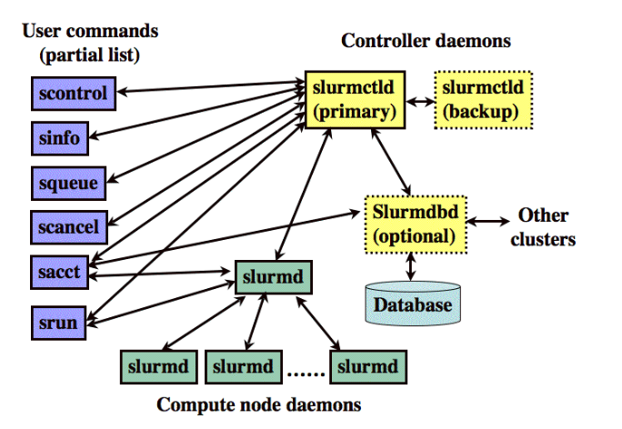




name: start
class: center, middle

# Upravljanje HPC sistemima
#### zatečeno stanje, performanse i upravljanja

---
name: sadrzaj

# Sadržaj

- [Zatečeno stanje](#stanje)
- [Merenje performansi HPC sistema](#merenje)
- [Tehnike upravljanja HPC sistemima](#tehnike)
- [SLURM](#slurm)
- [n1](#n1)
- [n2](#n2)
- [n3](#n3)
- [n4](#n4)

---
name: stanje
class: center, middle

# Zatečeno stanje
#### šta imamo?

---
layout: true

.section[[Zatečeno stanje](#sadrzaj)]

---

## Commodity Cluster i MPA

- Dosta je priče o tome kako računari možda izgledaju i kako su nekad izgledali.
- Kako izgleda super-računar danas?
    - Ključnije: 
        - Kako izgleda super-računar koji mi koristimo.

---

## Arhitektura ugrubo

- Imamo više čvorova koji su povezani nekakvom mrežom.
- Svaki čvor ima:
    - `n` fizičkih procesora koji imaju
    - `m` logičkih procesora (jezgara) koji podržavaju
    - `k` niti izvršavanja
    - neku količinu memorije koji ti procesori dele
    - `g` kartica za ubrzanje sa svojim specijalizovanim resursima za proračunavanje

- Ti čvorovi su povezani u jedan sistem kroz nekakvu mrežu

---

## U praksi…

- Računari sa kojima mi radimo će gotovo sigurno biti commodity cluster tipa.
- To znači 1 čvor = 1 PC
- Taj neki čvor ima:
    - 1 procesor
    - ~4 jezgara koji podržavaju po
    - 2 niti izvršavanja
    - Neki broj GB memorije (~16GB)

    - jednu ili dve grafičke kartice `NVidia` tipa

- Svi čvorovi su povezani na brzu `Ethernet` mrežu.

---

## U praksi…

- Svaki računar je individualna mašina, sa svojom instalacijom Linux-a.
- Na svakom računaru su instalirani određeni alati, biblioteke, itd. koje omogućavaju da se resursi između računara efektno iskoriste.
- Primer:
    - `OpenMP`  nam omogućava da koristimo paralelizam na nivou te jedne mašine.

- `OpenMPI` nam omogućava da koristimo paralelizam između mašina.
- `OpenACC`  nam omogućava da koristimo `CUDA` resurse na udoban način.
- `SLURM` nam omogućava da kontrolišemo šta se izvršava i gde.

---

### Naš plan

- Da bi savladali ovo, naš plan jeste da:
    - `Benchmarking`. Naučimo kako merimo i biramo super-računarsku instalaciju.
    - `Resource management`. Naučimo kako da upravljamo onim što imamo.
    - `Parallel programming`. Naučimo tehnologije koje nam omogućavaju paralelizme.
    - `The Problem`. Savladamo neke primere problema sa kojima se suočavamo i smislimo kako da ih ubrzamo.
    - `Domain specific libraries`. Naučimo kako da koristimo specijalizovane biblioteke za istu svrhu.
    - `Profiling`. Naučimo kako da izmerimo to što smo napravili.
    - `Visualization`. Naučimo kako da prikažemo šta smo izračunali.
    
---

layout: false
name: merenje
class: center, middle

# Merenje performansi HPC sistema
#### koliko je brzo `brzo`?

---
layout: true

.section[[Merenje performansi HPC sistema](#sadrzaj)]

---
## Koncept

- Sabiranje performansi konstituenata HPC sistema proizvodi nekakve brojeve: toliko-i-toliko FLOPS-a.
- To nisu osobito korisni brojevi. Mogli bi i da sabiramo težine komponenti: koja je svrha ako nam ta vrednost nešto ne kaže.
- Možemo da modeliramo ponašanje, ali taj model bi uskoro postao izuzetno nezgodan za korišćenje i opet ne bi uhvatio sve detalje ponašanja.
- Rešenje je jednostavno: postavimo nekakav problem i merimo koliko je naš sistem dobar u njegovom rešavanju.

- Ako razmislite o tome, ovo je isto što se radi studentima:
    - Postavi se problem (ispit)
    - I mere se performanse (ocena).

---

## Problemi

- Naravno, ni ovo nije savršeno.
- Kakav tip problema se izabere, kako se postavi, konfiguriše, i koristi jako utiče na rezultat koji se dobije.
- Grubo gledajući, možemo da podelimo sva merenja performansi na:
    -Sintetičke
    -Prirodne
- Sintetički se lako kontrolišu i skaliraju.
- Prirodni daju izuzetno verodostojne rezultate—samo što nismo sigurni šta je to što mere.
- Primer van HPC: 3DMark vs. framerate.

---

## Malo istorije…

- Prvi `benchmark` ikada je bio za `ENIAC` (prikladno) i bio je računanje trajektorije đuleta u odnosu na isti proračun koji obavlja balistički računar ili ljudsko biće.
- Inženjer je, na kraju krajeva, prvobitno bio vojni termin.
- Prvi benchmark u široj upotrebi je 'Whetstone' nazvana po gradiću u kome je razvijena.

- `Whetstone benchmark` je bila kolekcija programa koji su stvarali sintetički problem koji je evaluirao broj instrukcija u datoj sekundi.
- Kasnije, kako su se potrebe menjale, počeo je da uključuje i floatingpoint instrukcije, te je merio i `FLOPS`.
---

## Malo istorije…

- Pošto je Whetstone specijalizovan za `FLOPS`, napravljen mu je pandan koji meri performanse sa celim brojevima.
- A pošto programeri vole malo šta više od igre rečima, ovaj pandan se zvao `Dhrystone`.
- Danas Dhrystone je zamenjen sa SPECint paketom.
- I Whetstone i Dhrystone nisu bili namenjeni za HPC, već za evaluaciju procesora.

---

## Linpack

- Najuticajniji benchmark u upotrebi se pojavio 1979 i baziran je na bibliotekama za linearnu algebru poznate kao Linpack (danas zamenjene sa Lapack/BLAS paketom softvera). 
- Linpack meri performanse floating-point operacija, i baziran je na rešenju problma oblika:

                𝐴𝑥 = 𝑏
- Ograničenje: 
    - `A` mora da ima nimalo ili jako malo elemenata koji su 0. 
    - `A` je `nxn` matrica
    - `x` je vektor `x0…xn`
    - `b` je vektor `b0…bn`
- Ovo je ekvivalent rešavanju sistema od `n` jednačina sa `n` nepoznatih.

---

## Linpack

- Linpack je prošao kroz iteracije:
    - Prva iteracija je stavljala n na 100 i algoritam koji je koristila je bio serijski.
    - Da bi rezultat bio merodavan, izvorni kod nije smeo da bude modifikovan: jedino parametri kompajliranja.

- Druga iteracija je podigla n na 1000 i:

    -Dozvolila je da se prilagođava izvorni kod faktorizatora i rešavača.

    -Dozvolila je, konsekventno, paralelizaciju.

    -Uvela je uslov tačnosti nad rezultatima.

- Treća iteracija je HPL.

---

## Highly Parallel Linpack

- *Highly Parallel Linpack* — HPL je naznačajniji benchmark svoje vrste.
 - On, pre svega, se koristi da meri `FLOPS` vrednosti za super-računare i služi da se lista 500 najbržih odredi.

- HPL je uveo još značajnije promene:
    - Samo je problem fiksan
    - Veličina ulaznih podataka može da varira.
    - Softver može da varira
- Ove promene dozvoljavaju HPLu da se izvršava na uređajima sa distribuiranom memorijom.

---

## Parametri HPL-a

- Do 20 različitih zadataka je dozvoljeno, mi specificiramo koliko hoćemo da probamo.
- Svaki od zadataka je specificiran preko `n`, tj. broja jednačina i broja nepoznatih.
- Zatim je dozvoljeno do 20 različitih veličina bloka
    - Bloka? Način na koji algoritmi ovog tipa rade jeste da rekurzivno razbijaju matricu na pod-matrice. Blok definiše koliki će biti individualni segment.
    - Gotovo sigurno je u rasponu 32..256 a određuje se empirijski.

- Zatim se specificira kako se matrica deli po čvorovima
- Dalje, kaže se koliko različitih konfiguracija procesnih čvorova se koristi za proračun.

---

## Malo više o blokovima

.medium[

- Neka je naš zadatak da odredimo `C = AB`, gde su `A, B, i C 8x8` matrice.
 - Onda možemo izdeliti svaku od tih matrica u 4 4x4 pod-matrice kao što je pokazano desno.
- U praksi, ovo je idealna verzija koja se često menja.

- Ideja iza ovog tipa optimizacije jeste povećanje lokalnosti koda.
- Setite se priče o kešu.
- Vratićemo se na ovo kasnije.
]

<p>

$$ \begin{bmatrix}C_{11} & C_{12} \\C_{21} & C_{22} \end{bmatrix}=\begin{bmatrix}A_{11} & A_{12} \\A_{21} & A_{22} \end{bmatrix}\begin{bmatrix}B_{11} & B_{12} \\B_{21} & B_{22} \end{bmatrix} $$
  
$$ C_{11}=A_{11}B_{11}+A_{12}B_{21} \\ C_{12}=A_{11}B_{12}+A_{12}B_{22} \\ C_{21}=A_{21}B_{11}+A_{22}B_{21} \\ C_{22}=A_{21}B_{12}+A_{22}B_{22} \\  $$ 

</p>

---


## Parametri HPL-a

.medium[

- Zatim se specificiraju sve konfiguracije, jedna po jedna, u obliku PxQ

    - Zašto tako? Zato što se matrica bukvalno deli među čvorovima tako što se čvorovi zamisle u matričnoj organizaciji, te se svakom čvoru `odseče` određeni segment matrice.

    - Ovo znači da će naš proces biti pokrenut, nužno, na PxQ čvorova, šta god drugo mi specificirali prilikom pokretanja.

    - P i Q se biraju empirijki i zavise od topoloigije naše mreže. Ako je mreža mesh-ovana tako da imamo više linija za svaki računar onda je najbolje da je P blizu Q a Q malo veće od P. U slučaju prostog Ethernet-a najbolje je biti pljosnat: Za nas 1x4 možda 2x2.

- Linija 13 definiše stepen tačnosti do kog računamo. 16.0 je tipična vrednost, mada se ona može povećavati i do stotina hiljada. Ovo je zbog nepreciznosti poređenja floating point brojeva, prvo, i skale koja se koristi za test.

- Ostatak služi za podešavanje algoritma o čemu više kada budemo radili linearnu algebru u HPC okruženju.
]

---


##Rezultati HPL-a

- HPL nam omogućava da odredimo veći broj vrednosti i od njih nas zanima:
    - `Rpeak` — Broj FLOPSa koji smo izračunali da je teoretski moguć
    - `Rmax + Nmax` — Ovo je veličina ulaznog skupa (Nmax) za koju je ostvaren najveći stvarni broj FLOPSa (Rmax).
    - `N1/2` — Veličina ulaznog skupa za koju je ostvareno pola maksimalne ostvarene performanse.

---

## Osobine dobrog benchmark-a

- Da li je HPL dobar benchmark? 
    - Šta znači biti `dobar` u ovom kontekstu?
- Bazirano na iskustvu može se reći da dobar benchmark ima sledeće osobine:
    - `Realizam`. Mora simulirati tip rada na koji se nailazi u praksi.
    - `Univerzalnost`. Adekvatno radi na velikom broju arhitektura.
    - `Popularnost`. Dosta korisnika znači da imamo dosta uporedivih rezultata.
    - `Kompaktnost`. Mali broj linija koda znači manje šuma.
    - `Uređenost`. Postoje jasna pravila oko toga kako se dobijaju merodavni rezultati 
    - `Standardizovanost`. Upotreba standardnih tehnologija.

---

## HPC Challenge

- `HPC Challenge Benchmark Suite` je malo opširnija alternativa HPL-u.
- Sa pozitivne strane: meri mnogo više stvari.

- Sa negativne strane: ne proizvodi jednu stvar, nego više, što čini samerljivost kompleksnijom. 
- Čak i da primenimo matematičku koncepciju razdaljine u višedimenzionalnom prostoru, i dalje moramo da ustanovimo zajedničku skalu plus da odredimo funkciju metrike. 
- Kao rezultat moguće je formulisati beskonačno mnogo samerljivosti što nas ostavlja sa ogromnim koordinacionim problemom.
    
---


## HPC Challenge

.medium[

- HPCC se sastoji od sledećih mera:
    - `DGEMM`
        - Mnozenje matrica* matrica, slicno HPLu nameni 
    - `STREAM`
        - Sinteticki problem koji meri dugorocnu moc memorije 
    - `PTRANS`
        - Paralelizovano transponovanje matrica
    - `RandomAccess`
        - Nasumično poostavlja nove celobrojne vrednosti u nasumične delove memorije. 
        - Meri se u *Giga Updates Per Second: GUPS*. 
    - `FFT `
        - Jednodimenzionalna kompleksna diskretizovana Furjeova transformacija
    - `B_eff`
        - Kašnjenje i protočna moć za različite obrasce komunikacije
]

---

## Šta odlikuje HPCC?

- Fokus na memoriju.
- Distribuirani sistemi su izuzetno osetljivi na zadatke koji zahtevaju slobodan tok podataka kroz ceo sistem.

- HPCC stress-testira baš ovaj deo koji konvencionalniji HPL uglavnom ignoriše.

- Ovo ne čini HPL-lošim niti HPCC dobrim.
    - Što?  
- Namena računara diktira šta želimo da merimo.

---

## High Performance Conjugate Gradients

- `HPCG` održavaju isti ljudi kao i HPL i služi da meri stvari koje HPL ne dodiruje.
- Problem koji HPC rešava je sasvim isti kao onaj koji rešava HPL.
- Pa koja je onda razlika?

---

## HPCG

- I HPCG meri performanse floating-point operacija, i baziran je na rešenju problma oblika:

                    𝐴𝑥 = 𝑏
- Ograničenje: 
    - A mora da ima većinu elemenata koji su jednaki 0.
    - A je nxn matrica
    -x je vektor x0…xn
    -b je vektor b0…bn
- Ovo je ekvivalent rešavanju sistema od n jednačina sa n nepoznatih.

---

## HPCG

- To što je A retka matrica menja tehnologiju za rešavanje potpuno.
- Glavna je stvar to što ima puno komunikacije između čvorova i puno redukcionih operacija o čemu više uskoro.
- Ovo menja rezultate jako, jako, jako puno.
- Koliko puno?

- Razlika između ostvarenih performansi za HPL i HPCG je 15000%.
    - Prosečno. Vrhunski sistemi ostvaruju na HPCG oko 1% onoga što ostvaruju na HPL.
    - Postoje izuzeci, ali čak i šampion, tkzv. K-računar ostvaruje samo 5.3%.

---
    
## NAS Parallel Benchmarks

- NPB je sličan HPCC-u u tome što predstavlja kombinaciju tipičnih problema.
- Specifično predstavlja 8 tipičnih problema koji su poznati pod svojim dvoslovnim skraćenicama.

---


### NPB Skraćenica

.center-table.small[
| **Skraćenica** |         **Značenje**        |                             **Objašnjenje**                             |
|:--------------:|:---------------------------:|:-----------------------------------------------------------------------:|
|       IS       |         Integer Sort        | Sortiranje celih brojeva. Testira celobrojnu brzinu i performanse mreže |
|       EP       |    Embarassingly Parallel   |                     Testira blizu-maksimlanu brzinu.                    |
|       CG       |      Conjugate Gradient     |            Radi račun karakteristične vrednosti retke matrice           |
|       MG       |          MultiGrid          |    Integracija diferencijalne jednačine kroz metodu više rezolucija.    |
|       FT       |       Discrete 3D FFT       | Integracija 3D parcijalne diferencijalne jednačine po vremenu kroz FFT. |
|       BT       |   Block Tridiagonal Solver  |            Rešavanje sistema jednačina trodijagonalnog  tipa.           |
|       SP       | Scalar Pentadiagonal Solver |           Rešavanje sistema jednačina pentadijagonalnog tipa.           |
|       LU       |    LU Gauss-Seidel solver   |                        Isto što i HPL, efektivno.                       |

]

---

## Graph500

- Do ovog trenutka,postoji odrećena tendencija u svim ovim merama:
    -Diferencijalne jednačine 
    - Sistemi linearnih jednačina raznih tipova.
    - Bazične celobrojne operacije.
- Ovo su primeri problema simulacija za građevinu,masinstva,i fizičku, opste govoreći.
- To je lepo,ali nisu svi problemi ovakvi. 
- Veliki skupovi problema se predstavljaju kroz operacije nad grafovima. 
---

## Graph500    

- Graph500 ne samo da odgovara tom domenu nego radi i u širem kontekstu—simulira aplikacije sa intenzivnim pristupom podacima.
- Graph500 definiše, u stvari, 3 benchmark-a
    - Graph500 1 — konkurentna pretraga
    - Graph500 2 — Najkraća putanja
    - Graph500 3 — Najveći nezavisni skup (tj. najveći skup čvorova grafa takvih da nikoja dva nisu povezana)
- Samo Graph500 1 je implementiran i to preko Breadth First Search-a grafa, tako što za 64 jedinstvena početna čvora u tom grafu nađe sve čvorove do kojih se može doći.
- Graf je cikličan, bez težina, i neusmeren.
---

## Graph500

- Graph500 je implementiran sa istovremenim `OpenMP`  i `OpenMPI` paralelizmom što odgovara modernim sistemima.
- Rezultate ne vraća u FLOPS-ima u TEPS-ima (Traversed Edges Per Second)
- Poređenje između `FLOPS` i TEPS je teško ali ima jedna druga stvar koja je jako bitna:
    - U FLOPS-ima računari nastavljaju svoj eksponencijalni rast.
    - U TEPS-ima performanse stagniraju.
    - Arhitekture deljene memorije su mnogo bolje (u kontekstu TEPS-pojezgru) od arhitektura distribuirane memorije.
    - Ovo možete čitati kao "breakthrough wanted" znak.

---
## Miniaplikacije

- Sve do sada, svi ovi benchmark-ovi rade sa sintentičkim podacima koji pokušavaju da simuliraju šta bi stvarna aplikativna primena postigla.
- Mogu se meriti rezultati punih aplikacija, naravno, ali su oni tako specifični da nisu osobito korisni: nisu univerzalni i nisu sveprisutni.
- Pokušaj da se odradi kvadratura kruga ovde jesu miniaplikacije: pojednostavljeni ali realni poslovi.
- Ovoga se dotičemo kada budemo radili domenski-specifične biblioteke mnogo, mnogo kasnije.

---

layout: false
name: merenje
class: center, middle


# Tehnike upravljanja HPC sistemima

#### SLURM, PBS, i podešavanje za performantnost 

---
layout: true

.section[[Tehnike upravljanja HPC sistemima](#sadrzaj)]

---

## Čime to moramo da upravljamo?

- Nema nekakve magije u HPC klasteru.
- To su stvarno samo Linux računari u mreži.
- Brzi računari povezani brzom mrežom, istina, ali to je sve.
- `OpenMP`  programi su samo multi-threaded programi na jednom računaru. To se pokreće na isti način kao i svaki drugi program—to ste probali.
- `OpenMPI` tehnologija je neophodna da se uključi više čvorova.
- Tu se programi moraju pokretati posebnom komandom i to na svakom čvoru.
- Kada pokretati koliko programa i koje im resurse dodeliti… to je dosta posla da se radi rukom čak i na malom klasteru.

---

## Upravljanje HPC klasterima

- Rešenje je specijalizovan softver koji služi da upravlja čvorovima i pokreće stvari kad mi hoćemo kako mi hoćemo.
- Softver se tipično sastoji od servisa koji rade na raznim delovima HPC klastera i komandama koje komuniciraju sa tim servisima.

---

## Resursi koje kontroliše upravljački softver

.medium[
- Čvorovi za računanje.
    - Osnovna stvar koja se kontroliše. Na svaki računar se moraju slati podaci, pokretati procesi, gasiti procesi, itd.
- Procesorska jezgra.
    - U okviru jednog računara je neophodno alocirati individualna jezgra i to na drugačiji način budući da su njihove karakteristike drugačije.
- Računarske veze 
    - Mreža u klasterima može biti jako kompleksna i heterogena. Upravljački softver se stara i da to radi kako treba
- Eksterna memorija
    - Upravljački softver se stara da je eksterna memorija dostupna i maksimalno performantna.
- I/O. 
    - Komunikacija sa spoljnim svetom ne može biti ad hoc.
- Akceleratori
    - U heterogenim sistemima akceleratori proračuna (najčešće ali ne uvek GPU-ovi) su odvojen resurs koji se posebno alocira i posebno programira.
]

---
## Ključni koncepti upravljačkog softvera

- Glavni koncept su zadaci (*jobs*) koji predstavljaju jednu celinu koju korisnik hoće da pokrene.
- Zadaci mogu biti:
    - Interaktivni (*interactive*). — Postoji ljudski operator.
    - Automatski (*batch*). — Nema operatora. Najčešće zadaci su ovakvi.

- Iako mogu biti monolitni, tipično zadaci se sastoje od više koraka (*task* odn. *step*). Ono što karakteriše korake jeste da mogu imati potpuno različite zahteve nad resursima.

- Zadaci idu u redove (*queue*) izvršavanja i koji od zadataka koji stoje u redu se izvršava kada određuje proces reda izvršavanja (*scheduling*).

---

## Faktori koji utiču na proces reda izvršavanja

.medium[

- Dostupnost neophodnih resursa.
    - Ako nema gde da se nešto izvrši onda se sigurno neće izvršiti.
- Prioritet.
    - U zavisnosti ko zahteva izvršavanje i šta je priroda posla može da dođe na red ranije ili kasnije.
- Korisnički budžet resursa
    - Svaki korisnik može imati fiksnu količinu resursa koju sme da angažuje.
- Ograničenje broja zadataka.
    - Svaki korisnik može imati ograničeni broj zadataka koji sme zatražiti u nekom trenutku.
- Procenjeno vreme izvršavanja
    - Kada zadajemo zadatak uvek navodimo koliko vremena tražimo.
]

---

## Faktori koji utiču na proces reda izvršavanja

.medium[

- Ostvareno vreme izvršavanja.
    - Zadatak može biti prekinut u zavisnosti od toga koliko dugo se već izvršava.
- Uslovljenost zadatka.
    - Zadaci mogu zavisiti od završetka drugih zadataka.
- Događaji
    - Neki zadaci se samo dešavaju kada se na nivou celog sistema desi nekakav događaj.
- Dostupnost operatora.
    - Interaktivni zadaci su samo mogući ako ima neko fizički prisutan za terminalom.
- Dostupnost licence.
    - Ponekad naš kod zahteva licence koje se prodaju po jezgru. To znači da je to samo još jedan resurs koji treba alocirati.
]

---

## Popularni alati za upravljanje HPC sistemima.

.medium[

- *Simple Linux Utility for Resource Management (SLURM)* — moćno, proširivo FOSS rešenje.
- *Portable Batch System* — Alternativa koja je nekad bila komercijalan kod, a sada postoji u FOSS varijanti.
- *OpenLava* — Još jedna alternativa.
- *Moab Cluster Suite* — Komercijalan softver fokusiran na ekstremnu skalabilnost.
- *LoadLeveler* — IBM proizvod prvobitno namenjen za AIX.
- *Univa Grid Engine — Oracle/Sun* rešenje za heterogene računarske sisteme.
- *HTCondor — FOSS* rešenje za high-throughput coarse-grained HPC.
- *OAR* — Rešenje fokusirano oko data-intensive problema
- *Hadoop Yet Another Resource Negotiator* — Rešenje za map-reduce.

]

---


layout: false
name: slurm
class: center, middle


# SLURM
#### uvod

---
layout: true

.section[[SLURM](#sadrzaj)]

---
## ?


---

## Pre će biti ovaj…


---

## Zašto fokus na alat?

- Uopšteno govoreći, nije svrha ovakvog kursa da vam se čitaju uputstva odnosno man stranice.
- No, ipak će tu i tamo biti baš toga.
- Što?
- Pa ovde je razlog jednostavan: kroz razumevanje parametara i komandi `SLURM` sistema imamo priliku i da naučimo:
    - Šta su faktori u upravljanju klasterima?
- Kako se pažljivim upravljanjem resursima podižu performanse sistema i naročito performanse po utrošenom novcu?
- Kao bonus, takođe možete da naučite i kako se `SLURM` može koristiti što će vam biti od koristi.

---

## Zašto je `SLURM` odličan?

- Jednostavan
- Gotovo beskonačno skalabilan:
    - `SLURM` se koristi, na primer, na TaihuLight mašini sa nekih 40 000 CPU-ova i 10 000 000 jezgara.
    - Od najbržih 10 računara oko 5 koristi `SLURM`.
    - 1000 zadataka se može zakazati po sekundi a 500 izvršiti.
- Podržava heterogene tehnologije

---

## Arhitektura `SLURM` sistema



---

## Grupisanje elemenata upravljanja u `SLURM` sistemima

- Čvorovi se mogu ubacivati u particije.
- Particije mogu biti:
    - Disjunktne
    - Preklapajuće
- Particije odgovaraju redovima izvršavanja
- Zadaci se grupišu u nizove zadataka koje odlikuju isti parametri izvršavanja.

---

## Raspored izvršavanja (*scheduling*) u `SLURM` sistemima

- Ovo je sve proširivo, ali grubo govoreći imamo tri različita pristupa koja rade istovremeno.
- Raspored izvršavanja vođen događajima.
- Ukupni raspored izvršavanja.
- Unazad propagirajući raspored izvršavanja.

---

## Raspored izvršavanja vođen događaijma

- Ovo je najjednostavniji način da se rasporede zadaci.
- Takođe je najbrži.
- Kada god se promeni status sistema (neki čvor se uključi, neki zadatak se završi, itd.) pokrene se ovaj algoritam.
- Algoritam uzme određeni broj zadataka sa prednjeg kraja reda i analizira ih u skladu sa ranije pomenutim faktorima.
- Sve što je nazad u redu se ignoriše dok ne stigne na prednji kraj.
- Ovo je brzo ali može dovesti do ne baš efikasne raspodele.

---

## Ukupni raspored izvršavanja.

- Ukupni algoritam se pokreće samo povremeno zato što mora da posmatra sve zadatke koji su zakazani.
- Ovo ga čini sporim.
- Balans između efikasnijeg sistema rasporeda zadataka i usporenja usled troškova sistema se postiže povremenim pokretanjem koje sprečava da se nisko-efikasne situacije u rasporedu propagiraju.

---

## Unazad propagirajući raspored izvršavanja.

- Naročit primer ne-efikasnosti jeste kada imamo zadatke niskog prioriteta a velikih zahteva.
- Jasno je da oni moraju da čekaju, ali ako stalno stižu prioritetniji poslovi, čekaće zauvek.
- Unazad propagirajući sistem za raspored analizira očekivano vreme kada svi poslovi treba da počnu, koliko treba da traju, i do kada se izvršavaju i traži vremena gde se izvršavanje nisko-prioritetnih poslova može udenuti tako da ne izazove kašnjenja u opštem rasporedu sistema.

---
## Napredni koncepti u sistemu rasporeda izvršavanja SLURM

- Gang scheduling
- Preemption
- Generic resource allocation
- Trackable resources.
- Elastic computing.
- High-throughput computing.

---

## Gang scheduling

- Mehanizam gde poslovi koji imaju slične prohteve za resursima dele iste resurse tako što jedni drugima predaju ekskluzivnu kontrolu.
- Najbolje radi ako imamo particiju čija konfiguracija odgovara prohtevima te klase poslova.
- Particije baš za to i služe.
- Mehanizam odredi dužinu alokacije (koja se zove `timeslice` i konfigurabilna je) i kada god prođe jedan timeslice suspenduje tekući zadatak i aktivira suspendovan zadatak iste klase zahteva koji najduže čeka u suspendovanom stanju.

- Ovo jako liči na to kako se radi mulit-tasking na računarima sa jednom niti izvršavanja.

---

## Preemption

- Mehanizam gde zadaci nižeg prioriteta mogu da se zaustave kada se alociraju zadaci višeg prioriteta kojima trebaju resursi koji su već u upotrebi.
- Radi isto kao gang scheduling sa tim da:

    - Iniciranje algoritma ne radi proticanje vremena, no alokacija resursa za nov zadatak.
    - Promena ko se izvršava nije u round-robin sistemu, no je vođena prioritetom.

---

## Generic resources

- Odnosi se na posebne hardverske module koje može da ima nekakav čvor i koji ga, stoga, čine osobenim.
- Šta je to?
    -GPU
    - MIC
    - A, u budućnosti?
        - FPGA
        - Kripto-modul
        - Kvantni računar
        - Kvantni simulator kaljenja
        - Neuro-akcelerator

---

## Generic resources

- Šta god da je generički resurs, mi možemo da zahtevamo čvor koji ga ima i sistem za raspored izvršavanja će voditi računa o tom zahtevu.

- Menadžment GRES-ovima nije baš savršen: suspendovanje zadataka trenutno ne oslobađa GRES-ove zato što se postavlja pitanje šta GRES može da sačuva a šta ne i šta je "bezbedno početno stanje" za GRES.
- Praktično, za nas, readback iz GPU memorije je… pipava stvar.

---

## Trackable resources.

- `SLURM` ima mehanizam koji omogućava da se pažljivo prati i beleži upotreba raznih resursa (TRES-ova):
    - CPU-ova
    - Bafera
    - Energije
    - GRES-ova
    - Licenci
    - Memorija
    - Čvorova
- Ovo omogućava dijagnostiku i, tužno je reći, naplatu.

---

## Elastic computing.

- Mehanizam kojim sistem za upravljanje resursima može da analizira trenutne prohteve sistema i menja veličinu sistema na adekvatan način.

- Sistem se može smanjiti tako što se čvorovi za kojima nema potrebe automatski isključe.
- Kako se povećava? Normalno nikako, ali ako je u pitanju cloudbaziran sistem, moguće je raditi automatski provisioninig još resursa po potrebi, ili barem dok Amazonu ne ponestane.
- Naravno to košta stoga ovaj deo mora biti konfigurisan izuzetno pažljivo.

---

## High-throughput computing

- HTC je poseban scenario u okviru HPC problema gde je najprirodniji način da se problem opiše jeste preko jako velikog broja slabo povezanih zadataka.
- Idealan primer jeste renderovanje: svaki frejm je za sebe, a potencijalno želimo jako mnogo frejmova.
- Film od 90 minuta, na kraju krajeva, zahteva da renderujemo 129600 fejmova.
- Stoga `SLURM` ima posebnu logiku za slabo povezane mnogobrojne poslove koja dozvoljava da se pokrene po 500 takvih poslova u sekundi.

---

## Komanda srun
- Najosnovnija komanda `SLURM` sistema je srun
- Opšta sintaksa komande je: `srun [<options>] <executable>[<arguments>]`
- Značenje je da se sa određenim opcijama pokreće u okviru klastera komanda `executable` kao zadatak
- Ako se srun pokrene u okviru već pokrenutog zadatka definiše ne nov zadatak već nov korak.
- Kompleksnost ove naizgled jednostavne komande jeste u opcijama koje su često ključne za dobro izvršavanje

---

## -N opcija

- Opcija –N određuje broj čvorova koji se traži za komandu
- Mora imati makar jedan broj posle sebe, taj broj je minimalan broj čvorova koji tražimo.
- Može i da ima dva broja u obliku `–N<n1>-<n2>`
    - n1 je minimalni broj čvorova
    - n2 je maksimalni broj čvorova

---

## -n i –c opcije

- -n opcija služi da se podesi broj procesa koji će se pokrenuti
- Svaki proces je jedna instanca naše aplikacije
- Da bi ovo imalo smisla nadamo se da naša aplikacija zna kako da se ponaša u takvom okruženju.
- Podrazumevano je da 1 proces dobije 1 čvor
- Ovo menja –c opcija ona određuje koliko će jezgara biti alocirano po svakom procesu. To omogućava da imamo višestruke ali i višenitne procese, tj. `OpenMPI` + OpenMP.
- Ako bi zvršili srun –n4 –c8 app0 onda bi pokrenuli app0 četiri puta i to tako da svako pokretanje zauzme barem osam jezgara. To znači da ako imamo sistem sa po 16 jezgara po čvoru zauzećemo 2 čvora.

---

## --mincpus opcija

- Možemo komplikovati stvar tako što koristimo ovu opciju, jednu od mnogih koja postavlja ograničenje na tip čvora koji može da se koristi
- Sintaksa je, na primer, --mincpus=32 što, kao opcija, bi reklo da se naš program može izvršiti isključivo na čvorovima koji imaju bar 32 procesora/jezgra/niti (terminologija je malo labava, ali se misli na 32 paralelna izvršavanja).
- Ako bi komandu sa prošlog slajda promenili da bude srun –n4 –c8 – mincpus=32 app0 pokrenuli bi 4 procesa app0, svaki bi dobio 8 jezgara i svi bi bili na jednom čvoru sa 32 jezgra pod uslovom da takav postoji.

---

## Labava terminologija

- Budući da je ponekad nejasno šta se misli pod CPU ovih dana, `SLURM` uvodi jasnu terminologiju i komande koje manipulišu tim jasnim terminima u svrhu uvođenja ograničenja
- Po `SLURM` terminologiji:
    - Core je fizičko jezgro kojih je tipično više po čipu
    - Socket je fizički čip utaknut u ZIF utičnicu na nekom računaru
    - Thread je sistemska nit izvršavanja
- Opcije su:
    - `--cores-per-socket=<vrednost0>`
    - `--sockets-per-node=<vrednost1>`
    - `--threads-per-core=<vrednost2>`

- Ovo se može napisati i brže ovako:
    - `-B<vrednost1>[:<vrednost0>[:<vrednost2>]]`

---

## -m opcija

- Ova opcija podešava kako se procesi raspoređuju između čvorova/procesora itd.
- Ima izuzetnog uticaja na performanse i `tačne` vrednosti jako zavise od toga kako naš kod radi i kako funkcioniše lokalnost.
- Sintaksa je:
    - `-m<nodeDist>[:<socketDist>[:<coreDist>]][,{Pack,NoPack}]`

---

## A kako radi nodeDist?

- `*` — podrazumevana opcija, najčešće block
- `block` — procesi će biti dodeljeni redom čvoru dok ne ponestane resursa, te će onda biti slati dalje.
- `bcyclic` — procesi se dele po čvorovima tako što se da jedan prvoj, pa onda drugi drugoj i tako dok ne ponestane mogućih čvorova a onda se počinje od prvog, opet.
- `plane=<n>` — stavi n procesa na jedan čvor i onda ide dalje dabstavi n procesa na drugi čvor i tako.
- `arbitrary` — čita ponašanje iz sistemske promenljive

---

## coreDist i socketDist

- Rade isto kao nodeDist samo što:
- Podrazumevani režim je cyclic
- Cyclic će grupisati zadatke po jezgru/procesoru
- Fcyclic je neophodan da bi se zadaci među njima raspoređivali po 100% round-robin pristupu

---

## Pack i NoPack

- Pack i NoPack su hintovi sistemu koji određuju kako se sistem ponaša kada ima `izbor`
- Pack kaže da se procesi rasporede tako da maksimalno popune čvor
- NoPack kaže da se procesi rasporede tako da podela po alociranim resursima bude maksimalno fer, tj. ravnomerna

---

## -w opcija

- Dobija kao parametar ili listu čvorova koje hoćemo da alociramo poimence ili putanju do fajla gde se ta lista čvorova nalazi
- Ima više smisla u malim klasterima gde ponekad znamo tačno šta hoćemo
- U sistemima sa 40 000 procesora… ima manje smisla.

---

## Alokacija memorije

- Možemo tražiti memoriju po čvoru sa komandom `–mem=<m>` gde je <m> broj megabajta koji se alocira za zadatak.
- Možemo i tražiti memoriju tako što specificiramo koliko nam treba memorije po procesoru koristeći `–mem-per-cpu =<m>` na isti način.

---

## Automatsko podešavanje

- Možemo zatražiti pomoć sistema tako što sugerišemo kakav je tip problema sa kojim se suočavamo koristeći opciju `--hint=<type>` gde je tip jedno od:
    - `compute_bound` — algoritmu je usko grlo proračun, tako da se alociraju sva jezgra u svakom čipu sa po jednom niti po jezgru.
    - `memory_bound` — algoritmu je usko grlo memorija, tako da se koristi po jedno jezgro u svakom čipu i jedna nit po jezgru
    - `multithread` — koristi više niti po jezgru
    - `nomultithread` — nemoj koristiti više niti po jezgru

---

## Ograničavanje broja procesa

- Možemo podesiti da se nad jednim čvorom, čipom, ili jezgrom izvršava ne više od neke vrednosti n procesa kroz sintaksu:
    - `--ntasks-per-core=<n>`
    - `--ntasks-per-socket=<n>`
    - `--ntasks-per-node=<n>`

- `--ntasks-per-node=<n>` je naročito važna opcija jer ako se tu stavi 1, to je idealno za aplikacije koje koriste `OpenMP`  kombinovan sa `OpenMPI` budući da svaki čvor dobije jedan proces koji onda koristi niti za paralelizam unutar čvora.

---

## Ekskluzivnost

- Opcija `--exclusive` nam omogućava da zahtevamo da ne delimo čvorove sa drugim zadacima
- Ovo može biti bitno ako znamo da će rezultujuće zagušenje ugroziti performanse i našeg posla i tuđeg

---

## GRES ograničenje
- `--gres` opcija ima sintaksu `--gres=<resource_list>` gde je sintaksa za `resource list` takva da se sastoji od zarezima odvojene liste resursa, a resurs ima sintaksu koja je: `<name>[[:<type>]:count]`
- Recimo srun -N16 `--gres=gpu:kepler:2 app0` će startovati app0 na 16 čvorova koji moraju imati (i za upotrebu ove aplikacije alocirati) po 2 GPU-a tipa Kepler.

---

## -C opcija

- Možemo anotirati čvorove sa osobinama.
- -C opcija nam kasnije dozvoljava da tražimo čvor sa baš tim, anotiranim osobinama.
- Specifikacija za -C se piše odamh posle u znacima navoda i sastoji se od imena opcija razdvojenih sa & i | kao AND i OR operatorima.
- Takođe ima posebna sintaksa oblika `srun -N8 -C '[rack1|rack3|rack5]' app0`
- Ovo pokreće app0 na osam čvorova koji moraju da budu ili rack1 ili rack3 ili rack5.

---

## -t opcija

- Koliko vremena u satima:minutima:sekundama želimo da radi naš softver.
- Kada to vreme istekne dobijamo `TERM` signal
- Ako ne uradimo nešto sa tim TERM-om dobijemo uskoro i `KILL` signal

---

## Signali

- `TERM`? `KILL`?
- Unix ima svoju filozofiju komunikacije između procesa
- Jedan od glavnih jesu signali: softverski prekidi koji označavaju da se u sistemu desio nekakav događaj.
- Ponekad ih generišu drugi procesi, ponekad sam operativni sistem, a ponekad korisnik direktno.
- Signali imaju različito značenje
- Može se dobiti kompletna lista iz operativnog sistema

---
## Signali

```console
mt@mt:~/HPC$ kill -l
 1) SIGHUP	 2) SIGINT	 3) SIGQUIT	 4) SIGILL	 5) SIGTRAP
 6) SIGABRT	 7) SIGBUS	 8) SIGFPE	 9) SIGKILL	10) SIGUSR1
11) SIGSEGV	12) SIGUSR2	13) SIGPIPE	14) SIGALRM	15) SIGTERM
16) SIGSTKFLT	17) SIGCHLD	18) SIGCONT	19) SIGSTOP	20) SIGTSTP
21) SIGTTIN	22) SIGTTOU	23) SIGURG	24) SIGXCPU	25) SIGXFSZ
26) SIGVTALRM	27) SIGPROF	28) SIGWINCH	29) SIGIO	30) SIGPWR
31) SIGSYS	34) SIGRTMIN	35) SIGRTMIN+1	36) SIGRTMIN+2	37) SIGRTMIN+3
38) SIGRTMIN+4	39) SIGRTMIN+5	40) SIGRTMIN+6	41) SIGRTMIN+7	42) SIGRTMIN+8
43) SIGRTMIN+9	44) SIGRTMIN+10	45) SIGRTMIN+11	46) SIGRTMIN+12	47) SIGRTMIN+13
48) SIGRTMIN+14	49) SIGRTMIN+15	50) SIGRTMAX-14	51) SIGRTMAX-13	52) SIGRTMAX-12
53) SIGRTMAX-11	54) SIGRTMAX-10	55) SIGRTMAX-9	56) SIGRTMAX-8	57) SIGRTMAX-7
58) SIGRTMAX-6	59) SIGRTMAX-5	60) SIGRTMAX-4	61) SIGRTMAX-3	62) SIGRTMAX-2
63) SIGRTMAX-1	64) SIGRTMAX	
```

---

## Signali

.medium[
- Reakcija na signale
- Svaki tip signala ima jednu podrazumevanu akciju iz sledećeg skupa:
    - `Term`
        - Proces koji dobija signal se terminira
    - `Ign`
        - Proces koji dobija signal ga ignoriše.
    - `Core`
        - Podrazumevana akcija jeste da se terminira proces i da se u fajl izbaci sva memorija procesa.
    - `Stop`
        - Proces se pauzira.
    - `Cont`
        - Proces se nastavi ako je pauziran.
]

---

## Namena signala


.center-table.small[

| **Ime signala** | **Broj signala** | **Reakcija** |                                 **Svrha**                                |
|:---------------:|:----------------:|:------------:|:------------------------------------------------------------------------:|
|      SIGHUP     |         1        |     Term     | Prekinuta veza na kontrolnom terminalu, odn. smrt kontrolišućeg procesa. |
|      SIGINT     |         2        |     Term     |                                 Kontrol-C                                |
|     SIGQUIT     |         3        |     Core     |                             Quit sa tastature                            |
|      SIGILL     |         4        |     Core     |                           Ilegalna instrukcija                           |
|     SIGABRT     |         6        |     Core     |                               Abort signal                               |
|      SIGFPE     |         8        |     Core     |                           Floating-point greška                          |
|     SIGKILL     |         9        |     Term     |                             Ubijanje procesa                             |
|     SIGSEGV     |        11        |     Core     |                             Memorijska greška                            |
|     SIGPIPE     |        13        |     Term     |                    Greška u pisanju u dvosmerni bafer                    |
|     SIGALRM     |        14        |     Term     |                                  Tajmer                                  |

]

---

## Namena signala

.center-table.small[

| **Ime signala** | **Broj signala** | **Reakcija** |                    **Svrha**                    |
|:---------------:|:----------------:|:------------:|:-----------------------------------------------:|
|     SIGTERM     |        15        |     Term     |              Signal za terminaciju              |
|     SIGUSR1     |        10        |     Term     |             Rezervisan za korisnika.            |
|     SIGUSR2     |        12        |     Term     |             Rezervisan za korisnika.            |
|     SIGCHLD     |        17        |      Ign     |             Dete-proces je prekinut.            |
|     SIGCONT     |        18        |     Cont     |               Nastavi izvršavanje.              |
|     SIGSTOP     |        19        |     Stop     |              Pauziraj izvršavanje.              |
|      SIGSTP     |        20        |     Stop     |   Pauziraj izvršavanje (pokrenut sa terminala)  |
|     SIGTTIN     |        21        |     Stop     | Komunikacija sa terminalom za pozadinski proces |
|     SIGTTOU     |        22        |     Stop     | Komunikacija sa terminalom za pozadinski proces |

]

---

## Namena signala

.center-table.small[

| **Ime signala** | **Broj signala** | **Reakcija** |               **Svrha**               |
|:---------------:|:----------------:|:------------:|:-------------------------------------:|
|      SIGBUS     |         7        |     Core     |           Greška magistrale           |
|     SIGPOLL     |        29        |     Term     |            Sinonim za SIGIO           |
|     SIGPROF     |        27        |     Term     |   Tajmer za profiliranje je istekao   |
|      SIGSYS     |        31        |     Core     |      Greška u sistemskom pozivu.      |
|     SIGTRAP     |         5        |     Core     |         Breakpoint dostignut.         |
|      SIGURG     |        23        |      Ign     |      Hitna reakcija na socket-u.      |
|    ISGVTALRM    |        26        |     Term     |            Virtualni alarm            |
|     SIGXCPU     |        24        |     Core     |        Potrošeno svo CPU vreme.       |
|     SIGXFSZ     |        25        |     Core     | Potrošeno ograničenje veličine fajla. |
|      SIGIOT     |         6        |     Core     |          Isto što i SIGABRT.          |
|    SIGSTKFLT    |        16        |     Term     |Stek greška na koprocesoru.(Nekorišćeno)|
|       SIGIO     |        29        |     Term     |           I/O sada moguć.             |
|      SIGPWR     |        30        |     Term     |        Greška sa napajanjem           |

]

---


## Slanje signala

```console
kill -<signall> <pid>
kill -SIGURS1 10366
``` 

---

## Slanje signala

```c
#include <signal.h>
#include <stdio.h>
#include <unistd.h>

int main() {

    for(int i = 1; i < 99999999; i++){
        printf("%d\n", i);

        if(i == 4817)
            kill(getpid(), SIGTERM);
        }
    }
    return 0;
}
```
---

## Reagovanje na signal

```c
#include <signal.h>
#include <stdio.h>
#include <unistd.h>

void signalCallback(int sig){
    printf("Your precious TERM signal won't save you now! I got: %d\n", sig);
}
int main() {
    signal(SIGTERM, signalCallback);

    for(int i = 1; i < 99999999; i++){
        printf("%d\n", i);

        if(i == 4817)
            kill(getpid(), SIGTERM);
        }
        if(i == 5993)
            kill(getpid(), SIGKILL);
        }
    }
    return 0;
}

```

---

## Zakazivanje

- Jako je dobra ideja da se ne specificira samo vreme nego i vrednosti za `--begin` i `--deadline` opciju koje traže idealno vreme pokretanja i rok do koga se proračun treba završiti.
- Ovo omogućava inteligentnom sistemu za raspored izvršavanja da udene neke procese pre našeg na način koji nas ne usporava.
- Mnoge politike super-računara apsolutno zahtevaju ovakva podešavanja i to sa dobrim razlogom.

---

## -J opcija

- Omogućava da se specificira ime zadatka koje je različito od imena aplikacije.
- Čisto od administrativne vrednosti.

---

## --checkpoint opcije

- Opcija `--checkpoint=<time>` omogućava da se specificira koliko vremena prolazi između čuvanja stanja proračuna na permanentnu memoriju
- `--checkpoint-dir=<path>` određuje putanju gde se stanja proračuna čuvaju
- `--restart-dir=<path>` određuje putanja odakle se stanja proračuna učitavaju, osim ako ne radimo nešto jako lukavo ovo je isto kao vrednost prethodne opcije iz očiglednih razloga

---

## -D opcija

- Stara se da će se proces pokrenuti u specificiranom direktorijumu, a ne u direktorijumu gde izvršavamo `srun` komandu.

---

## -p opcija

- Specificira particiju na kojoj radimo
- Imamo opciju da navedemo više particija razdvojenih dvotačkama

---

## --mpi opcija

- `SLURM` samo može da radi ovo što radi uz pomoć MPI protokola
- Imaju razne implementacije MPI-ja i ova opcija omogućava da se izabere prava
- Za nas, to je manje-više uvek openmpi

---

## -l opcija

- Trivijalna sa tačke gledišta upravljanja sistemom ali odlična za nas
- `-l` nam daje oznaku na izlazu interaktivnih procesa koja specificira koji se proces startuje

---

## -K opcija

- Ako postavimo -K indikujemo da ako se bilo koji korak u zadatku završi i vrati ne 0 nego nešto drugo da ceo zadatak stane.
- Ovo je gotovo sigurno dobra ideja.

---

## salloc komanda

- Komanda ima iste parametre kao i srun i radi nešto vrlo slično.
- Alocira specificirane resurse i pokreće komandu koja je navedena.
- Svrha salloc jeste da komanda koju navedemo bude skripta puna srun komandi gde salloc alocira šta treba za sve zajedno, izvrši ih, i onda dealocira resurse.
- `salloc` je interaktivna komanda

---

## sbatch komanda

- Služi za automatsko, grupno izvršavanje posebno dizajniranih skripti
- Sbatch komanda podržava izvršavanje bez nadzora i automatski preusmerava ispis na izlazu skripte koju pokreće.
- Čim se izvrši, ona vrati kontrolu korisniku, a resursi se alociraju i posao odradi kasnije.
- Prosleđena skripta se, fizički, pokreće na prvom od alociranih čvorova.
- Izlaz će se naći u fajlovima oblika `slurm-<n>.out` gde je `<n>` broj posla.

---

## Nizovi poslova

- Jedan vrlo efektan način da se pokrene više stvari istovremeno jeste da se radi sa nizom poslova.
- Ako mi ne želimo da uradimo 30 različitih stvari, recimo, nego istu stvar (sa drugim podacima) 30 puta (što je realistična mogućnost) onda je niz idealan metod.
- Zašto je ovo bolje? Zato što `SLURM` unapred zna šta to hoćemo da uradimo i mnogo manje napadamo sistem zakazivanja izvršavanja što je slaba tačka `SLURM` sistema.

---

## Nizovi poslova

- Opcija da zahtevamo niz u sbatch komandi je -a praćena specifikacijom niza praćena opcionim ograničenjem konkurentnosti
- Specifikacija niza je ili:
    - indeksi razdvojeni zarezima
    - Raspon (tj. dva broja razdvojena crticom, npr. 2-7)
    - Raspon sa korakom (tj. dva broja razdvojena crticom praćena dvotačkom i korakom koji se koristi u brojanju između te dve vrednosti, npr. 2-10:2 što znači od 2 do 10 u koracima po 2)

- Ograničenje konkurentnosti ide posle specifikacije niza i sastoji se od znaka `%` posle koga ide broj poslova koji se sme istovremeno izvršavati.

---

## Kontrola imena izlaznih fajlova
- Jako nam je bitno da izlazni fajlovi imaju dobra imena. Zašto? Zato što će tu biti naši (dragoceni) rezultati. Ako ih izgubimo ili prepišemo jedne preko drugih uzalud smo računali.
- `-o opcija` definiše format imena izlaznog fajla sa određenim specijalizovanim simbolima koji se prilikom procesiranja posebno interpretiraju.
- `%A` će biti zamenjen identifikatorom niza
- `%a` će biti zamenjen indeksom posla unutar niza
- `%j` će biti zamenjen jedinstvenim brojem posla (ako ne koristimo nizove)
- `%N` je ime prvog čvora koji je alociran za posao.
- `%u` je ime korisnika koji je sve ovo pokrenuo

---

## Pisanje sbatch skripti

- sbatch ima posban format za skripte
- U osnovi to su shell skripte iz Unix sveta sa par malih modifikacija
- Glavne modifikacije u odnosu na shell skripte su:
    - Prisustvo posebnih promenljivih koje nam daje `SLURM`
    - `SBATCH` komentari

- `SBATCH` komentari su komentari koji počinju sa `#SBATCH` is posle kojih ide razmak a onda neki od parametara koji smo radili za srun opciju

---

## Shell skripte?

- Shell je kako se zove interpreter koji obrađuje interakciju korisnika sa komandnom linijom.
- Danas je manje-više standard *Bourne Again Shell* odn. `bash.` (zsh je popularan kod programera, ali se ne koristi za ovakve stvari).
- Shell skripta je način da se izvrši više korisničkih komandi, tipično na ne-interaktivan način.
- Windows ekvivalent su `.bat` fajlovi.

---

## Format shell skripte

- To je fundamentalno samo tekstualni fajl, ništa više
- Tipična ekstenzija je `.sh`, mada se skripte za sbatch često pišu sa `.sbatch` ekstenzijom.
- Ako želimo da se skripta sama izvršava onda mora počinjati sa posebnom linijom: `#!/bin/bash`
- Komentari u `shell` skriptama počinju sa znakom `#` i traju do kraja linije
- Sve ostale linije su komande koje se izvršavaju

---

## Promenljive u shell skriptama

- Pišu se svim velikim slovima
- Traju samo u fajlu u kojem se izvršavaju, ali mogu da učitaju vrednosti spolja, tj. iz okruženja `shell`-a koji skriptu pokreće.
- Da bi ih podesili dovoljno je da napišemo: `MYVAR = "vrednost"`
- Da bi ih iskoristili stavljamo ispred njihovog imena $, tako da da bi napravili fajl koji se zove po onome što je u `MYVAR` stavili bi ouch $MYVAR

- Ako postoji konfuzija oko toga gde se ime promenljive završava koriste se velike zagrade ovako:
```console
MYVAR="vrednost" 
I="4" 
touch ${MYVAR}_${I}
```

---

## Linux sistemske promenljive

- Ako hoćemo da naša promenljiva bude dostupna šire, sve što treba da uradimo jeste da ispred dodele vrednosti promenljive stavimo `export` ovako: 
    - `export $A="vrednost"`

- Ovako se podešava mnogo stvari u Linux sistemima: kada se ulogujete izvrše se skripte (`.bashrc` i `.profile`) koje izpodešavaju razne sistemske promenljive na takav način da su dostupne svakom programu koji pokrenete kao pod-proces procesa koji je pozvao export (što je svaki program ako je export pozvao `login shell`).

---

## Primer sbatch skripte

```console
#!/bin/bash 
# tophat_arrays.sbatch 
# 
#SBATCH -J tophat 
# A single job name for the array 
#SBATCH -p serial_requeue 
# Partition #SBATCH -n 1 
# one core #SBATCH -N 1 
# on one node #SBATCH -t 0-2:00 
# Running time of 2 hours #SBATCH --mem 4000 
# Memory request of 4 GB #SBATCH -o tophat_%A_%a.out 
# Standard output #SBATCH -e tophat_%A_%a.err 
# Standard error

mkdir trans${SLURM_ARRAY_TASK_ID}_out
cd trans${SLURM_ARRAY_TASK_ID}_out

tophat /n/informatics/databases/Mus_musculus/UCSC/mm10/Sequence/BowtieIndex \
../trans${SLURM_ARRAY_TASK_ID}.fq
```


.footer.medium[
  [Detaljnije](https://www.rc.fas.harvard.edu/resources/documentation/submitting-large-numbers-of-jobs-to-odyssey/)

] 


---

## `SLURM` sistemske promenljive

.center-table.small[

|       **Promenljiva**      |                 **Značenje**                 |
|:--------------------------:|:--------------------------------------------:|
|        SLURM_NTASKS        |          Šta je prosleđeno -N opciji         |
|    SLURM_NTASKS_PER_CORE   |  Šta je prosleđeno --ntasks_per_core opciji  |
|    SLURM_NTASKS_PER_NODE   |  Šta je prosleđeno --ntasks_per_node opciji  |
|   SLURM_NTASKS_PER_SOCKET  | Šta je prosleđeno --ntasks_per_socket opciji |
|     SLURM_CPUS_PER_TASK    |          Šta je prosleđeno -c opciji         |
|     SLURM_DISTRIBUTION     |          Šta je prosleđeno -m opciji         |
|    SLURM_JOB_DEPENDENCY    |          Šta je prosleđeno -d opciji         |
| SLURM_CHECKPOINT_IMAGE_DIR |   Šta je prosleđeno --checkpoint-dir opciji  |
|        SLURM_NNODES        |       Broj čvorova alociranih za posao       |
|   SLURM_JOB_CPUS_PER_NODE  |      Koliko imamo CPU-ova na ovom čvoru      |
|     SLURM_CPUS_ON_NODE     |   Koliko ima CPU-ova na ovom čvoru ukupno.   |
|      SLURM_SUBMIT_HOST     |      Ime računara odakle potiče zadatak      |
|     SLURM_CLUSTER_NAME     |      Ime klastera gde se posao izvršava      |

]

---

## `SLURM` sistemske promenljive

.center-table.small[

|    **Promenljiva**    |                  **Značenje**                 |
|:---------------------:|:---------------------------------------------:|
|  SLURM_JOB_PARTITION  |      Ime particjie gde se posao izvršava      |
|      SLURM_JOBID      |              ID trenutnog zadatka             |
|     SLURM_LOCALID     |         PID trenutnog procesa na čvoru        |
|      SLURM_NODEID     |                ID tekućeg čvora               |
|      SLURM_PROCID     |          Globalno-validan ID procesa          |
|   SLURM_JOB_NODELIST  |     Lista svih čvorova alociranih zadatku     |
|  SLURM_TASKS_PER_NODE |   Koliko se stvari izvršava na svakom čvoru   |
|  SLURM_ARRAY_TASK_ID  | Niz indeksa zadatak u okviru niza, ako ga ima |
|  SLURM_ARRAY_TASK_MIN | Niz indeksa zadatak u okviru niza, ako ga ima |
|  SLURM_ARRAY_TASK_MIN |        Najmanji indeks niza, ako ga ima       |
|  SLURM_ARRAY_TASK_MAX |        Najveći indeks niza, ako ga ima        |
| SLURM_ARRAY_TASK_STEP |         Korak u brojanju indeksa niza         |
|   SLURM_ARRAY_JOB_ID  |           ID celog niza, ako ga ima           |

]

---

## Jednostavan primer `SLURM` promenjevih

```console
#!/bin/bash
export OMP_NUM_THREADS=$SLURM_CPUS_PER_TASK
./omp_program
```

---

## Dodatne korisne `SLURM` komande

- `squeue`
    - Prikazuje poslove koji se izvršavaju ili koji čekaju i njihov status.
- `scancel`
    - Otkazuje izvršavanje zakazanog posla.
-`sacct`
    - Prikazuje agregirane statističke podatke o radu klastera.
- `sinfo`
    - Prikazuje podatke o konfiguraciji klastera



