


name: content

# Content

### MPI topics: 

- [Goal](#goal)
- [MPI execution model](#mpi)
- [Compiling & running an MPI program](#cr)
- [Point to point communication](#p2p)
- [Collective communication](#cc)

---
name: goal
class: center, middle, inverse

# Goal

---
layout: true

.section[[Goal](#content)]

---
## Goal

- Learn...
	- how an MPI program runs on a distributed memory system
	- how to write a basic MPI program
	- to use basic point-to-point and collective MPI communication

---

layout: false
name: mpi
class: center, middle, inverse

# MPI execution model

---
layout: true

.section[[MPI execution model](#content)]

---
##  MPI

- MPI is for *distributed memory* parallelization

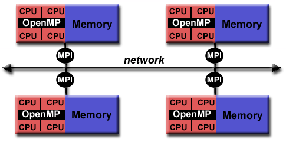

---
## MPI

- Official implementations generally for 
  - C/C++/Fortran
- Other language bindings:
	- Python (MPI4Py)
	- Java (OpenMPI)
- Examples in this course will be in C/C++

---

## Execution model

- MPI uses multiple processes to distribute work.
- Each node runs one (or more) MPI processes

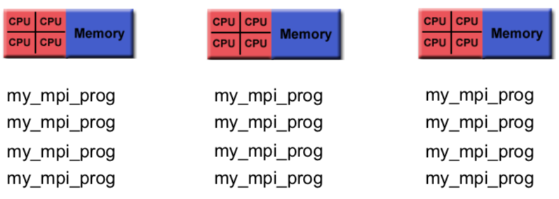

---
## Execution model

- Inspecting the processes on one node:


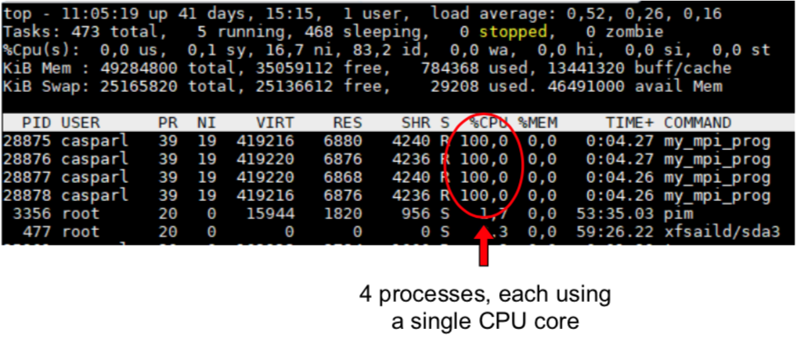

---
## Execution model

- Note the difference:
- OpenMP: 1 process, 4 threads
  


--
 
- MPI: 4 processes, 1 thread

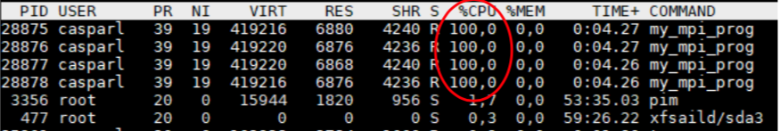

- NB: you can combine MPI + OpenMP. Not for beginners!

---

layout: false
name: cr
class: center, middle, inverse

# Compiling & running an MPI program

---
layout: true

.section[[Compiling & running an MPI program](#content)]

---
##  Compiling an MPI program

- To compile an MPI program, compiler wrappers (e.g. OpenMPI: mpicc /mpic++/mpifort/mpif90) are used.
	- Wrappers call normal C/C++/Fortran compiler
	- Wrappers link MPI library to program

- E.g.
```sh
	mpicc mpi_hello_world.c -o mpi_hello_world
```

---
##  Compiling an MPI program

- To run an MPI program, a startup script is used
	- mpirun (comes with MPI implementation, e.g. OpenMPI)
	- srun (SLURM batch manager)

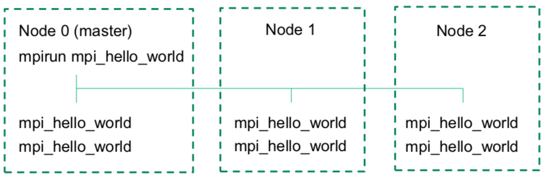

---
## Running an MPI program

- tartup scripts take arguments to determine
	- How many processes to launch
	- How many processes to launch per node
	- ... many more (try e.g. `mpirun --help`)

---
## Exercise: 

.message.is-info[
.message-header[
Exercise
]
.message-body[
- Compile & run <a target="_blank" rel="noopener noreferrer" href="/courses/mpi-training/#table-of-contents"> ☛ `mpi_hello_world.c`</a> 

- Compile:
```console
mpicc mpi_hello_world.c –o mpi_hello_world
```

- Run 4 MPI tasks in parallel:
```console
mpirun –np 4 mpi_hello_world
```

]
]

---
## Exercise: compile & run mpi_hello_world.c

- Output:
```sh
milovantomasevic@mt:~$  mpirun –np 4 mpi_hello_world
Hello world from 1
Hello world from 2
Hello world from 3
Hello world from 0
```
- Why does each process print a different number?

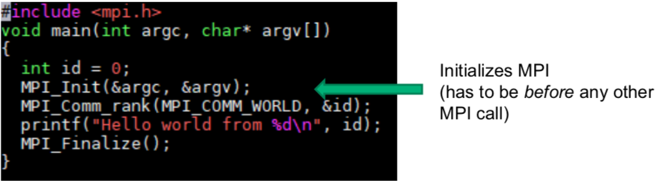

---
## Exercise: compile & run mpi_hello_world.c

- Output:
```sh
milovantomasevic@mt:~$  mpirun –np 4 mpi_hello_world
Hello world from 1
Hello world from 2
Hello world from 3
Hello world from 0
```
- Why does each process print a different number?

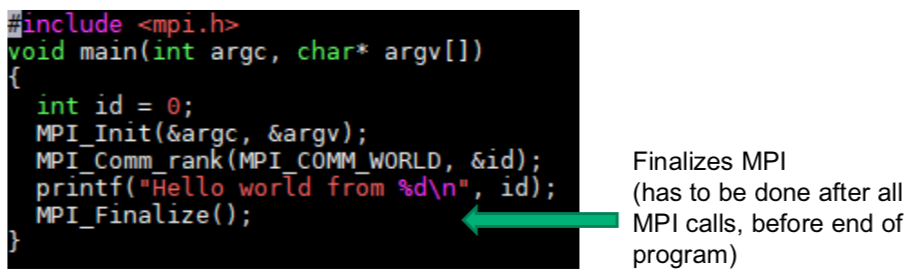

---
## Exercise: compile & run mpi_hello_world.c

- Output:
```sh
milovantomasevic@mt:~$  mpirun –np 4 mpi_hello_world
Hello world from 1
Hello world from 2
Hello world from 3
Hello world from 0
```
- Why does each process print a different number?

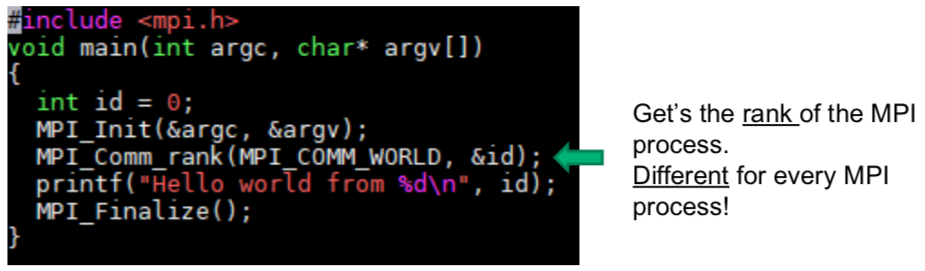

---
layout: false
name: p2p
class: center, middle, inverse

# Point to point communication

---
layout: true
.section[[Point to point communication](#content)]

---
## MPI Communicators

- MPI Communicator: connects groups of MPI processes
	- `MPI_COMM_WORLD`: contains all processes launched by a single mpirun
	- Can make smaller communicators
	- A process gets a rank per communicator
	- `MPI_Comm_rank(MPI_COMM_WORLD, &id)` gets rank of process in communicator `MPI_COMM_WORLD`

|           | MPI_COMM_WORLD | My_communicator |
|:---------:|:--------------:|:---------------:|
| Process 0 |     Rank 0     |                 |
| Process 1 |     Rank 1     |      Rank 0     |
| Process 2 |     Rank 2     |      Rank 1     |

---

## Rank

- Each MPI process runs *exactly* the same program *except* for their `rank`(s)
- Rank used to
	- Distribute work
	- Determine origin and target of communication
- In this course we only use `MPI_COMM_WORLD`

---
## Communication

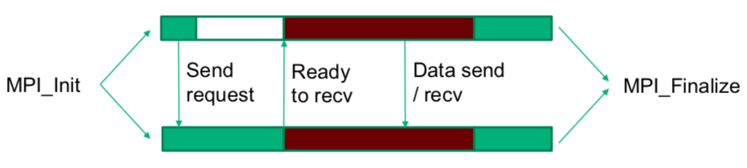

---
## Communication: point to point

- `MPI_Send()` and `MPI_Recv()`
	- Can be used to communicate between two ranks
	- Needs info on contents & ‘address label’

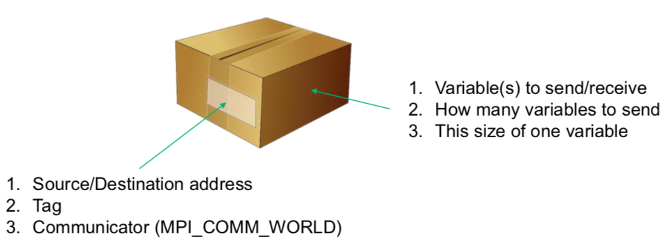

---
## Communication: point to point

- `MPI_Send()` and `MPI_Recv()` example:

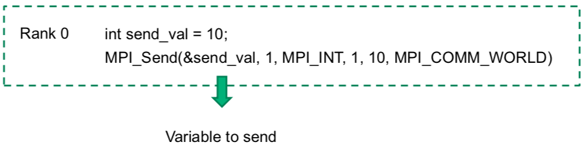

---
## Communication: point to point

- `MPI_Send()` and `MPI_Recv()` example:

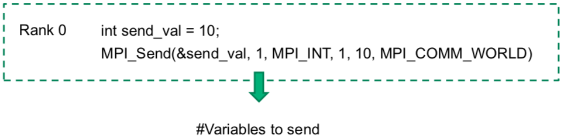

---
## Communication: point to point

- `MPI_Send()` and `MPI_Recv()` example:

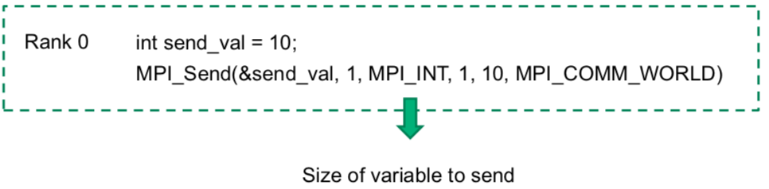

---
## Communication: point to point

- `MPI_Send()` and `MPI_Recv()` example:

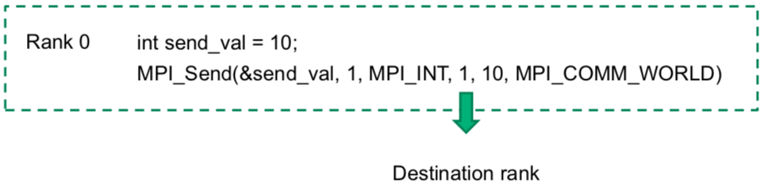

---
## Communication: point to point

- `MPI_Send()` and `MPI_Recv()` example:

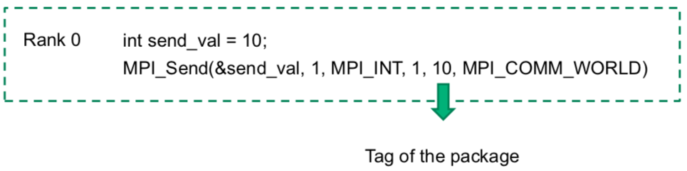

---
## Communication: point to point

- `MPI_Send()` and `MPI_Recv()` example:

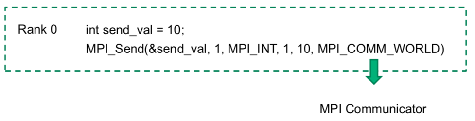

---
## Communication: point to point

- `MPI_Send()` and `MPI_Recv()` example:

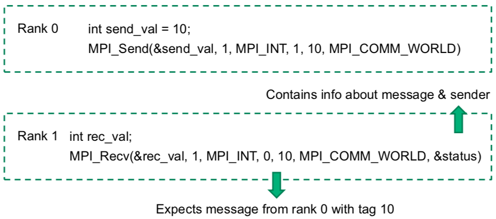

---
## Exercise: point to point

.message.is-info[
.message-header[
Exercise
]
.message-body[
- In this exercise, we try to send the variable ‘10’ from rank 0 to rank 1
	- Inspect <a target="_blank" rel="noopener noreferrer" href="/courses/mpi-training/#table-of-contents"> ☛ `mpi_pnt2pnt.c`</a> 
	- Specify the correct destination (XX)
	- Specify a correct source (YY)
	- Specify a correct tag (AA, BB). Should the tags be the same, or different?
]
]

---
## Communication: point to point

- `MPI_Send()` and `MPI_Recv()` are blocking

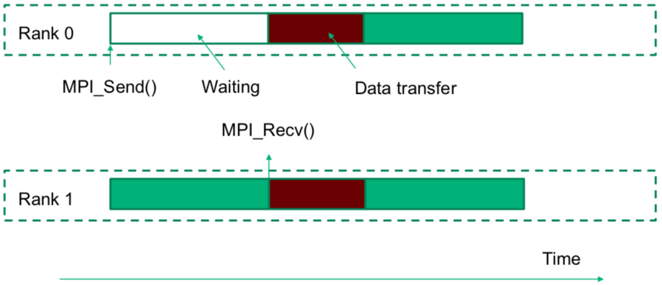

---
## Communication: point to point

- `MPI_Send()` and `MPI_Recv()` are blocking
- What is *wrong* with the following code?

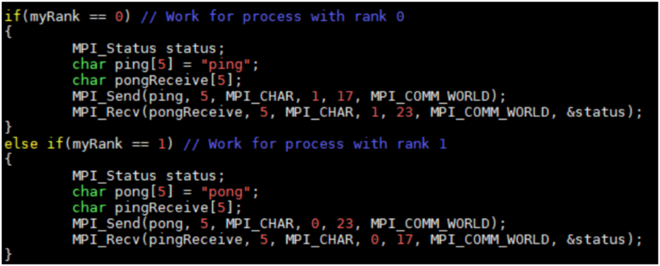

---
## Deadlock

- `MPI_Send()` and `MPI_Recv()` are blocking

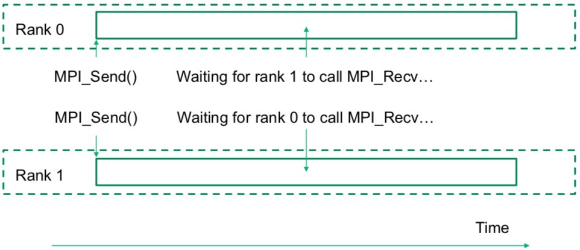

---
## Exercise: fix the deadlock

.message.is-info[
.message-header[
Exercise
]
.message-body[

- Fix the deadlock in <a target="_blank" rel="noopener noreferrer" href="/courses/mpi-training/#table-of-contents"> ☛ `mpi_pingpong.c`</a> 

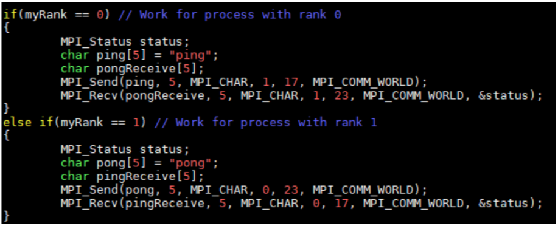
]
]

--
.message.is-warning[
.message-header[
Info
]
.message-body[
- **Hint**: think about the order of `MPI_Send/MPI_Recv` for each rank.
]
]

 
---

## Exercise: fix the deadlock

.message.is-success[
.message-header[
Solution
]
.message-body[
- **Solution**: reverse `MPI_Send` & `MPI_Recv` for one of the ranks

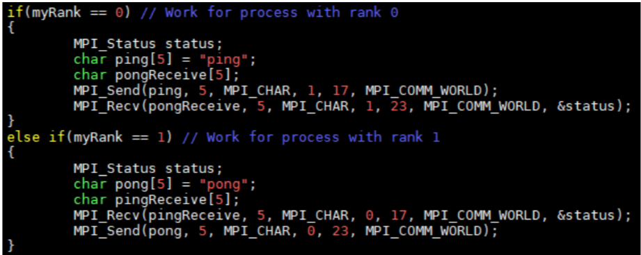
]
]

---
## Communication: point to point

- `MPI_Send()` and `MPI_Recv()` in reverse orders between rank 0 & 1:

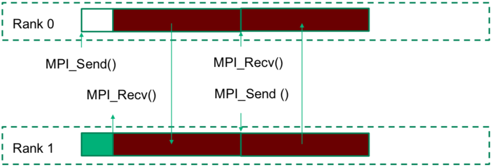

---
## Communication: non-blocking

- `MPI_Isend()` and `MPI_Irecv()` are non-blocking, e.g. 
```c
MPI_request request
MPI_Isend(&send_val, 1, MPI_INT, 1, 10, MPI_COMM_WORLD, &request)
```

- But: how to know the send has actually happened?	
  - `MPI_Wait` only returns once the send has completed
```c
MPI_Wait(&request, &status)
```

--

.message.is-warning[
.message-header[
Info
]
.message-body[
**WARNING**:
- Non-blocking routines can lead to race conditions if synchronization is not taken care of! 
- E.g. variables can be `read` before they are received.k.
]
]

---
## Communication: non-blocking

- `MPI_Isend()` and `MPI_Irecv()` are non-blocking

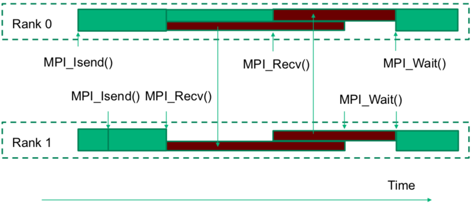

---
## Exercise: non-blocking communication

.message.is-info[
.message-header[
Exercise
]
.message-body[
- **Beginner**:
	- Compile and run <a target="_blank" rel="noopener noreferrer" href="/courses/mpi-training/#table-of-contents"> ☛ solutions/`mpi_pingpong.c`</a>
	- Compare the timing with the timing of mpi_pingpong
	- Which is faster? Can you understand why?
- **Advanced**:
	- Adept <a target="_blank" rel="noopener noreferrer" href="/courses/mpi-training/#table-of-contents"> ☛ exercises/`mpi_pingpong.c`</a> to use `MPI_Isend` and/or `MPI_Irecv`
	- Don’t forget to include an `MPI_Wait`
	- Compare the timing with the timing of `mpi_pingpong`
	- Which is faster? Can you understand why?
]
]

--
.message.is-success[
.message-header[
Solution
]
.message-body[
- **Answer**:
<br>The non-blocking routine is faster. <br>Communication from rank 1 → 0 can already start before communication from rank 0 → 1 is finished.
]
]

---
layout: false
name: cc
class: center, middle, inverse

# Collective communication

---
layout: true
.section[[Collective communication](#content)]

---
##  Communication: collectives

- MPI Collectives communicate over all processes in the communicator
	- Moving data
	- Collective computation

---
## Communication: collectives

- MPI Collectives for moving data
	- One to all

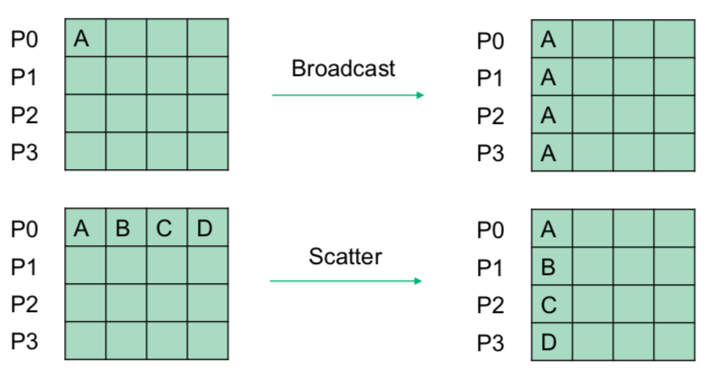

---
## Communication: collectives

- MPI Collectives for moving data
	- One to all
	- All to one

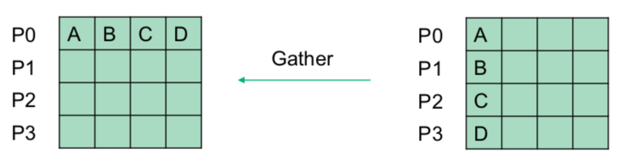

---
## Communication: collectives

- MPI Collectives for moving data
	- One to all
	- All to one
	- All to all

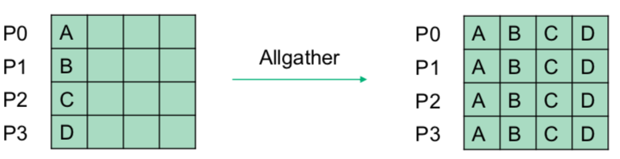

---
## Communication: collectives

- MPI Collectives for moving data
- ... and many more

---
## Communication: collectives

- MPI Collectives for collective computation

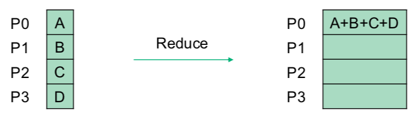

---
## Communication: collectives

- MPI Collectives for collective computation

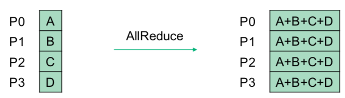

---
## Communication: collectives

- You could make all collectives with point-to-point communication...
- *Bad idea!*
- Collectives are convenient for the programmer
- Collectives can be `optimized` by the MPI implementation, e.g.

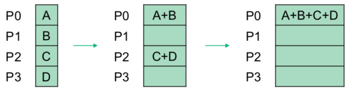

---
## Communication: collectives

- Exercise:
	- Compile and run the <a target="_blank" rel="noopener noreferrer" href="/courses/mpi-training/#table-of-contents"> ☛ `mpi_pi.c`</a>
	- What is the output of the different ranks?
	- What is the sum of those outputs?

---
## Communication: collectives

- Exercise part 2 (beginners):
- Check the <a target="_blank" rel="noopener noreferrer" href="/courses/mpi-training/#table-of-contents"> ☛ `mpi_pi.c`</a> file and uncomment the lines needed to ...
	- Add an MPI_reduce after the loop that calculates pi
	- Print the aggregated result

- Exercise part 2 (advanced):
- Open the <a target="_blank" rel="noopener noreferrer" href="/courses/mpi-training/#table-of-contents"> ☛ `mpi_pi_advanced.c`</a> file and ...
	- Add an `MPI_reduce` after the loop that calculates pi
	- Print the aggregated result

- Bonus questions:
	- Which is faster, <a target="_blank" rel="noopener noreferrer" href="/courses/openmp-training/#table-of-contents"> ☛ `omp_pi.c`</a> or <a target="_blank" rel="noopener noreferrer" href="/courses/mpi-training/#table-of-contents"> ☛ `mpi_pi.c`</a>?
	- Are the pi estimates returned by <a target="_blank" rel="noopener noreferrer" href="/courses/openmp-training/#table-of-contents"> ☛ `omp_pi.c`</a> and <a target="_blank" rel="noopener noreferrer" href="/courses/mpi-training/#table-of-contents"> ☛ `mpi_pi.c`</a> the same? Why (not)?
  
---
layout:false

##  MPI Summary

- MPI uses multiple processes
- Each MPI process runs the same program, only the ranks are different
- Ranks are used to distribute work
- Processes can communicate with MPI_Send/MPI_Recv (blocking) or MPI_Isend/MPI_Irecv (non-blocking)
- Non-blocking communication can lead to race conditions if synchronization is not taken care of!
- Collective MPI routines can move data (e.g. broadcast)
- Collective MPI routines can compute (e.g. reduce)

---
## MPI vs OpenMP

|                     **OpenMP**                    |                       **MPI**                      |
|:-------------------------------------------------:|:--------------------------------------------------:|
|      Parallelize within node (shared memory)      | Parallelize in & across nodes (distributed memory) |
|                 Easy to implement                 |                 Harder to implement                |
| Worksharing part of framework (e.g. parallel for) |    Worksharing mostly programmers responsibility   |
|            Reductions part of framework           |            Reductions part of framework            |
|         Variables may be shared or private        |        All variables private to MPI process        |

---

name: end
class: center, middle

# That's All 👨🏻‍🎓
# Thank you for listening!

--

class: center, middle, theend, hide-text
layout: false
background-image: url(../theend.gif)

