


name: content

# Content

### Components of OpenMP:

- [Goal](#goal)
- [Execution model (multithreading)](#openmp)
- [Library functions](#lib)
- [OpenMP directives](#dir)
- [OpenMP worksharing](#work)

---
name: goal
class: center, middle, inverse

# Goal

---
layout: true
.section[[Goal](#content)]

---
## The goal is to learn:

- How multithreading can be used for parallel computation
- The structure of the OpenMP framework (library, directives)
- How OpenMP can be used to distribute work

---

layout: false
name: openmp
class: center, middle, inverse

# Execution model (multithreading)

---
layout: true

.section[[Execution model (multithreading)](#content)]

---
## OpenMP

- OpenMP is for *shared memory* parallelization


---
## Execution model

-  OpenMP Execution model: multithreading to distribute work

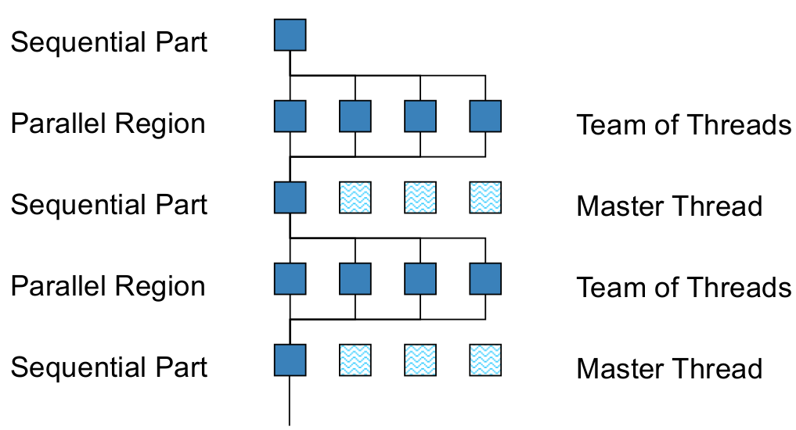

---

## Multithreading

- Threads may be scheduled on different CPU cores (by OS)
	- exploits multi-core hardware
- Our task as programmers (e.g. with OpenMP) :
	- Create multiple threads
	- Distribute work over threads
	- Make sure threads can execute independently! (dependencies / race conditions)

---
## Multithreading

- Multithreaded process is a single process.
- E.g. inspecting an OpenMP program with 4 threads, using ‘top’ command:

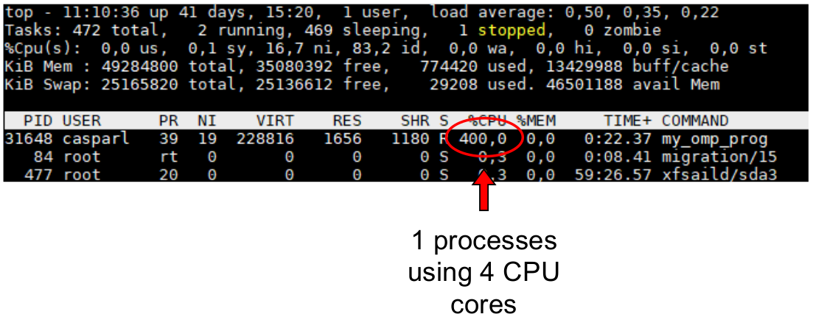

---

layout: false
name: lib
class: center, middle, inverse

# Library functions

---
layout: true
.section[[Library functions](#content)]

---

## OpenMP Library routines

- Library routines are normal C/C++/Fortran functions from the OpenMP library.
	- `omp_get_thread_num`: returns number of current thread
	- `omp_get_num_threads`: returns total number of threads
	- `omp_get_wtime`: return elapsed walltime in seconds
	- Many more (search web: OpenMP Cheat Sheet)

---

## Exercise: OpenMP Library Routine

- Exercises in this course will be in C/C++, but note that OpenMP also supports Fortran

---

## C/C++ program structure

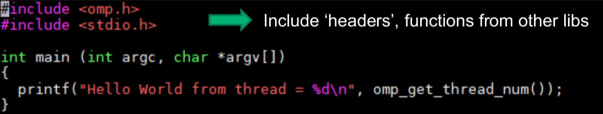

--

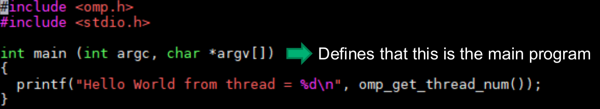

--

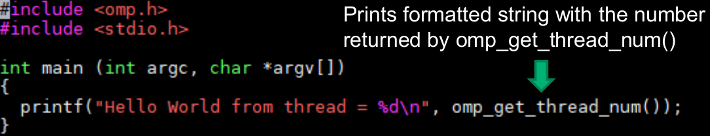

---

## Let’s try! Compile & run using

.message.is-info[
.message-header[
Exercise
]
.message-body[
- <a target="_blank" rel="noopener noreferrer" href="/courses/openmp-training/#table-of-contents"> ☛ `omp_threadnum.c`</a>
```console
gcc -o omp_threadnum omp_threadnum.c -fopenmp
./omp_threadnum
```

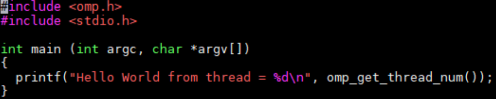

- Result:
```sh
mt@mt:~/OpenMP/exercises$ ./omp_threadnum 
Hello World from thread = 0
```
]
]

- Only one thread! For now...

---

layout: false
name: dir
class: center, middle, inverse

# OpenMP directives

---
layout: true
.section[[OpenMP directives](#content)]

---
## OpenMP directives

- OpenMP uses directives to create threads. These have the general form

```c
	#pragma omp directive-name
```

- For example, the `parallel` directive can be used to create threads, and execute the following code section in parallel

```c
	#pragma omp parallel
	{
		omp_get_thread_num();
	}
```

---
## Exercise: OpenMP parallel “Hello world”

.message.is-info[
.message-header[
Exercise
]
.message-body[
- Edit `omp_hello.c` to put the `printf` in a parallel section:

```c
#pragma omp parallel
	{
		...
	}
```

- Compile and run: <a target="_blank" rel="noopener noreferrer" href="/courses/openmp-training/#table-of-contents"> ☛ `omp_hello.c`</a>
```console
gcc -o omp_hello omp_hello.c -fopenmp
./omp_hello
```
]
]

---
## Exercise: OpenMP parallel “Hello world”

.message.is-success[
.message-header[
Solution
]
.message-body[
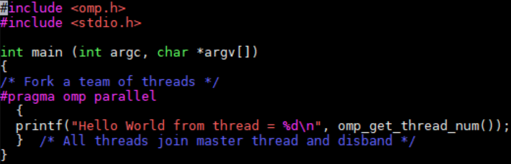

- Result:
.medium[
```sh
mt@mt:~/OpenMP/solutions$ gcc -o omp_hello omp_hello.c -fopenmp
mt@mt:~/OpenMP/solutions$ ./omp_hello 
Hello World from thread = 0
Hello World from thread = 6
Hello World from thread = 4
Hello World from thread = 3
Hello World from thread = 5
Hello World from thread = 2
Hello World from thread = 1
Hello World from thread = 7
```
]
- Random, order, why?
]
]

---
## Private and shared variables

- *Private variables*: each thread works on it’s own copy of the variable
- *Shared variables*: threads work on a single copy of the variable
- By default, most OpenMP variables are `shared` variables

---
## OpenMP clauses for directives

- OpenMP directives can have `clauses`
```c
#pragma omp directive-name [clause]
```
- Clauses are like additional arguments to the directive. E.g.

```c
	#pragma omp parallel private(x)
	{
		...
	}
```

- Will make sure each thread in the parallel section works on its own copy of ‘x’

---
## Private and shared variables

- Slightly different “Hello world”: what can go wrong? Which variables (should) be made private?

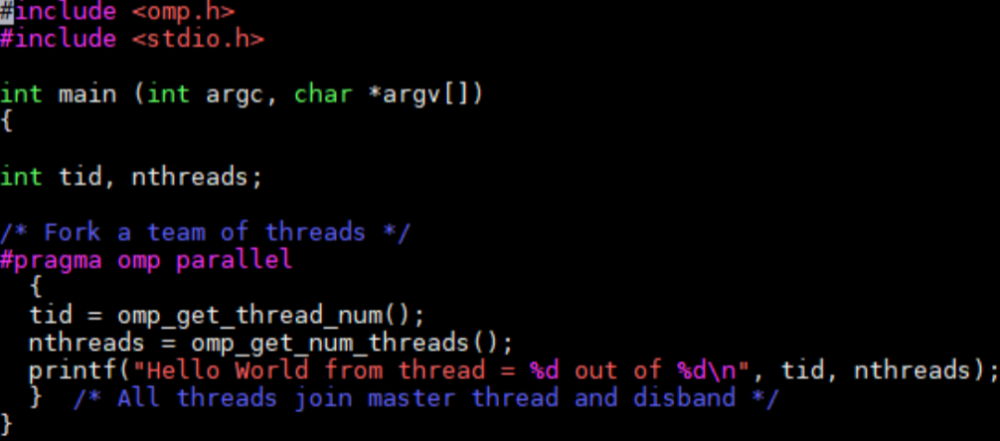

---
## Private and shared variables

- The risk: race conditions

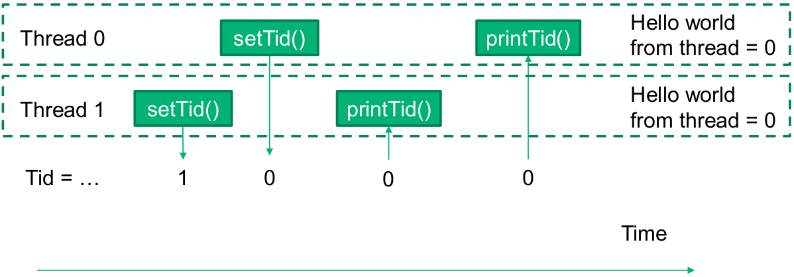

---
## Private and shared variables

- Solution: `private variable`. 
- Each thread should have its own copy of `Tid`

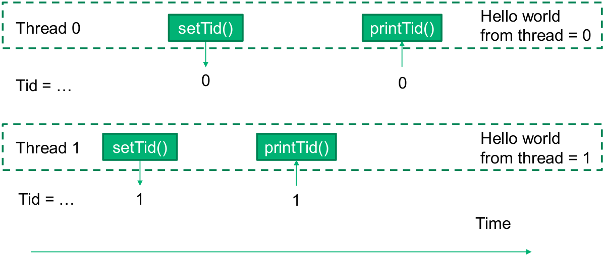

---
## Private and shared variables

- Each thread should have it’s own `tid`. 
- Use the `private` clause!

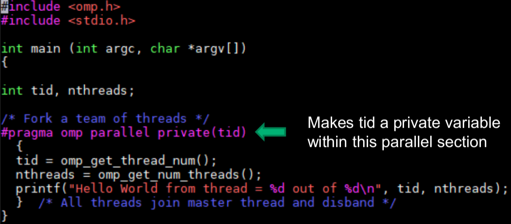

---

layout: false
name: work
class: center, middle, inverse

# OpenMP Worksharing

---
layout: true
.section[[OpenMP Worksharing](#content)]

---
## OpenMP Worksharing

- You could use thread IDs to distribute work, but OpenMP offers more convenient mechanisms.
- Example: `parallel for-loop`

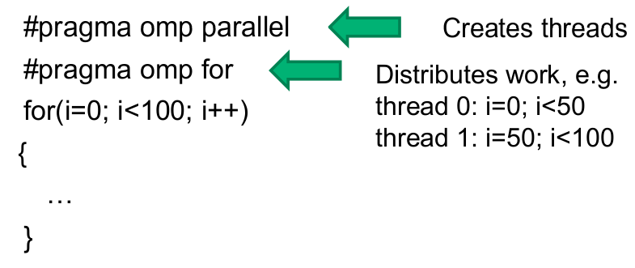

---
## OpenMP Worksharing

- You could use thread IDs to distribute work, but OpenMP offers more convenient mechanisms.
- Example: `parallel for-loop`

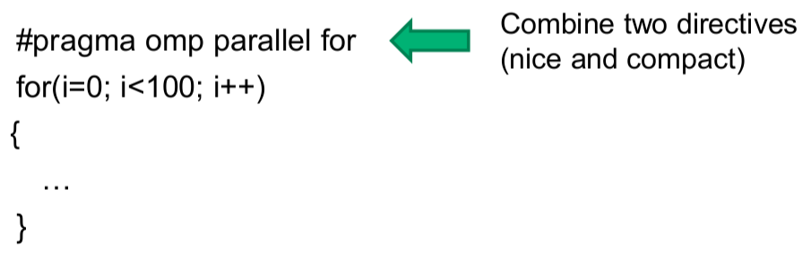

---
## Exercise: OpenMP Worksharing

.message.is-info[
.message-header[
Exercise
]
.message-body[

- The file <a target="_blank" rel="noopener noreferrer" href="/courses/openmp-training/#table-of-contents"> ☛ `omp_vectadd.c`</a> contains code that:
	- Generating two random vectors with 1M elements
	- Adds the two vectors in a `for-loop`
- Exercise:
	- Add the OpenMP `parallel for` directive to parallelize the loop
	- Compile the program:
	```sh
gcc -o omp_vectadd omp_vectadd.c -fopenmp
```
	- Run the program in serial & parallel:
	```sh
		OMP_NUM_THREADS=1 ./omp_vectadd
		OMP_NUM_THREADS=4 ./omp_vectadd
	```

- N.B. the `OMP_NUM_THREADS` environment variable controls the max. nr. of threads created by OpenMP
]
]

---
## Exercise: OpenMP Worksharing

.message.is-warning[
.message-header[
Info
]
.message-body[
- Which takes longer?
	- `OMP_NUM_THREADS=1 ./omp_vectadd`
	- `OMP_NUM_THREADS=4 ./omp_vectadd`
- Why?
- Overhead is significant if the computation `inside` the parallel region is `light`!
]
]

---
## Reduction clause

- You may want to parallelize a sum, e.g.
```c
#pragma omp parallel for
for(i=0; i<100; i++)
{sum = sum+i;}
```

- But `sum = sum+i` creates a race condition: all threads reading and writing to the same variable!

---
## Reduction clause

- Ok, what about...
```c
#pragma omp parallel for private(sum)
for(i=0; i<100; i++)
{sum = sum+i;}
```
- ?
- Declaring `sum` private doesn’t help: you need to add all `private` sums at the end.

---

## Reduction clause

- This is where the reduction clause comes in:
```c
#pragma omp parallel for reduction([reduction-op],[init_value])
```

- Example:
```c
#pragma omp parallel for reduction(+,sum)
for(i=0; i<100; i++)
{sum = sum+i;}
```

- Other reduction-ops: `+, -, *, max, min, &, &&, |, ||, ^`

---
## Exercise: Calculate PI

.message.is-info[
.message-header[
Exercise
]
.message-body[
- Exercise: PI can be approximated using Leibnitz sum.
	- Adept <a target="_blank" rel="noopener noreferrer" href="/courses/openmp-training/#table-of-contents"> ☛ `omp_pi.c`</a> to parallelize the for loop calculating pi
	- Use the reduction clause `(#pragma omp parallel for reduction(+,pi))`
	- Compile with 
		```sh
			gcc -o omp_pi omp_pi.c -fopenmp
		```
	- Run with 
```console
		OMP_NUM_THREADS=1 ./omp_pi
		OMP_NUM_THREADS=4 ./omp_pi
		OMP_NUM_THREADS=24 ./omp_pi
```
	- What is different from the vector addition in terms of speed?
	- How far does the problem scale?
	- Increasing (only) `OMP_NUM_THREADS`, is that strong or weak scaling?

]
]

---
layout:false

# OpenMP summary

- OpenMP...
	- uses multithreading
	- consists of `library routines, directives`
	- enables easy distribution of work through work sharing directives
	- directives have optional clauses (`arguments`)
	- the reduction clause can be used to parallelize recursive sums, products, max/min opreations etc.
	- has an excellent cheat sheet!

---

name: end
class: center, middle

# That's All 👨🏻‍🎓
# Thank you for listening!

--

class: center, middle, theend, hide-text
layout: false
background-image: url(../theend.gif)

