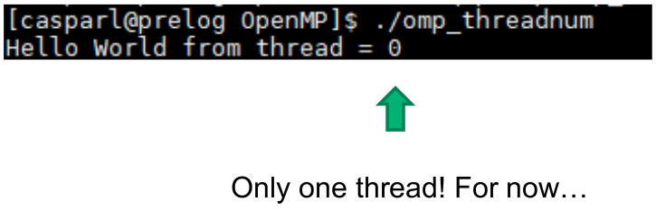




name: openmp
class: center, middle

# OpenMP

---
layout: true

.section[[OpenMP](#sadrzaj)]

---
## The goal is to learn:

- How multithreading can be used for parallel computation
- The structure of the OpenMP framework (library, directives)
- How OpenMP can be used to distribute work

---

## Components of OpenMP

- Execution model (multithreading)
- Library functions
- OpenMP directives
- OpenMP worksharing

---

## OpenMP is for *shared memory* parallelization


---

## OpenMP Execution model: multithreading to distribute work


---

## Multithreading

- Threads may be scheduled on different CPU cores (by OS)
	- exploits multi-core hardware
- Our task as programmers (e.g. with OpenMP) :
	- Create multiple threads
	- Distribute work over threads
	- Make sure threads can execute independently! (dependencies / race conditions)

---

## Multithreaded process is a single process.

- E.g. inspecting an OpenMP program with 4 threads, using ‘top’ command:


---

## OpenMP Library routines

- Library routines are normal C/C++/Fortran functions from the OpenMP library.
	- `omp_get_thread_num`: returns number of current thread
	- `omp_get_num_threads`: returns total number of threads
	- `omp_get_wtime`: return elapsed walltime in seconds
	- Many more (search web: OpenMP Cheat Sheet)

---

## Exercise: OpenMP Library Routine

- Exercises in this course will be in C/C++, but note that OpenMP also supports Fortran

---


## C/C++ program structure


---

## Let’s try! Compile & run using

- module load intel/17.0
```console
icc –qopenmp omp_threadnum.c –o omp_threadnum
./omp_threadnum
```


---


## Let’s try! Compile & run using

- module load intel/18.2
```console
icc –qopenmp omp_threadnum.c –o omp_threadnum
./omp_threadnum
```




---
## OpenMP directives

- OpenMP uses directives to create threads. These have the general form

```c
	#pragma omp directive-name
```

- For example, the ‘parallel’ directive can be used to create threads, and execute the following code section in parallel

```c
	#pragma omp parallel
	{
		omp_get_thread_num();
	}
```

---
## Exercise: OpenMP parallel “Hello world”

- Edit omp_hello.c to put the ‘printf’ in a parallel section:

```c
#pragma omp parallel
	{
		...
	}
```

- Compile and run:

```console
icc –qopenmp omp_hello.c –o omp_hello
./omp_hello
```

---
## Exercise: OpenMP parallel “Hello world”

- Solution:


---
## Exercise: OpenMP parallel “Hello world”

- Result:


---
## Private and shared variables

- *Private variables*: each thread works on it’s own copy of the variable
- *Shared variables*: threads work on a single copy of the variable
- By default, most OpenMP variables are `shared` variables

---
## OpenMP clauses for directives

- OpenMP directives can have `clauses`
```c
#pragma omp directive-name [clause]
```
- Clauses are like additional arguments to the directive. E.g.

```c
	#pragma omp parallel private(x)
	{
		...
	}
```

- Will make sure each thread in the parallel section works on its own copy of ‘x’

---
## Private and shared variables

- Slightly different “Hello world”: what can go wrong? Which variables (should) be made private?


---
## Private and shared variables

- The risk: race conditions


---
## Private and shared variables

- Solution: `private variable`. 
- Each thread should have its own copy of `Tid`


---
## Private and shared variables

- Each thread should have it’s own `tid`. 
- Use the `private` clause!


---
## OpenMP Worksharing

- You could use thread IDs to distribute work, but OpenMP offers more convenient mechanisms.
- Example: `parallel for-loop`


---
## OpenMP Worksharing

- You could use thread IDs to distribute work, but OpenMP offers more convenient mechanisms.
- Example: `parallel for-loop`


---
## Exercise: OpenMP Worksharing

- The file omp_vectadd.c contains code that:
	- Generating two random vectors with 1M elements
	- Adds the two vectors in a `for-loop`
- Exercise:
	- Add the OpenMP `parallel for` directive to parallelize the loop
	- Compile the program: `icc –qopenmp omp_vectadd.c –o omp_vectadd`
	- Run the program in serial & parallel:
		- `OMP_NUM_THREADS=1 ./omp_vectadd`
		- `OMP_NUM_THREADS=4 ./omp_vectadd`

- N.B. the `OMP_NUM_THREADS` environment variable controls the max. nr. of
threads created by OpenMP

---
## Exercise: OpenMP Worksharing

- Which takes longer?
	- `OMP_NUM_THREADS=1 ./omp_vectadd`
	- `OMP_NUM_THREADS=4 ./omp_vectadd`
- Why?
- Overhead is significant if the computation `inside` the parallel region is `light`!

---
## Reduction clause

- You may want to parallelize a sum, e.g.
```c
#pragma omp parallel for
for(i=0; i<100; i++)
{sum = sum+i;}
```

- But `sum = sum+i` creates a race condition: all threads reading and writing to the same variable!

---
## Reduction clause

- Ok, what about...
```c
#pragma omp parallel for private(sum)
for(i=0; i<100; i++)
{sum = sum+i;}
```
- ?
- Declaring `sum` private doesn’t help: you need to add all `private` sums at the end.

---

## Reduction clause

- This is where the reduction clause comes in:
```c
#pragma omp parallel for reduction([reduction-op],[init_value])
```

- Example:
```c
#pragma omp parallel for reduction(+,sum)
for(i=0; i<100; i++)
{sum = sum+i;}
```

- Other reduction-ops: `+, -, *, max, min, &, &&, |, ||, ^`

---
## Exercise: Calculate PI

- Exercise: PI can be approximated using Leibnitz sum.
	- Adept `omp_pi.c` to parallelize the for loop calculating pi
	- Use the reduction clause `(#pragma omp parallel for reduction(+,pi))`
	- Compile with ‘icc -qopenmp omp_pi.c -o omp_pi’
	- Run with
		- `OMP_NUM_THREADS=1 ./omp_pi`
		- `OMP_NUM_THREADS=4 ./omp_pi`
		- `OMP_NUM_THREADS=24 ./omp_pi`
	- What is different from the vector addition in terms of speed?
	- How far does the problem scale?
	- Increasing (only) `OMP_NUM_THREADS`, is that strong or weak scaling?

---
# OpenMP summary

- OpenMP...
	- uses multithreading
	- consists of `library routines, directives`
	- enables easy distribution of work through work sharing directives
	- directives have optional clauses (`arguments`)
	- the reduction clause can be used to parallelize recursive sums, products, max/min opreations etc.
	- has an excellent cheat sheet!

---
layout:false
name: end
class: center, middle

# Thank you for listening!


