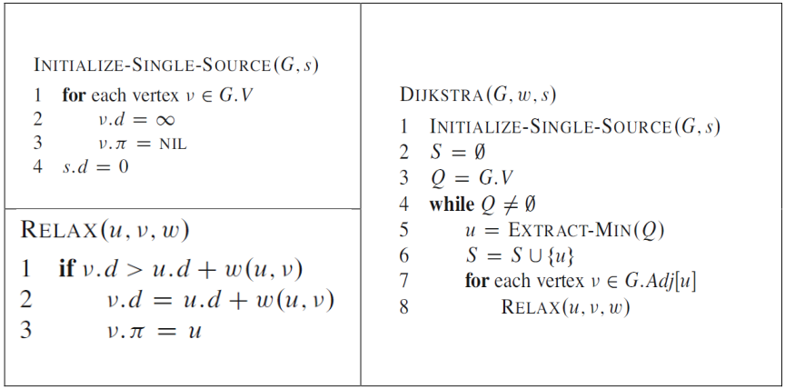
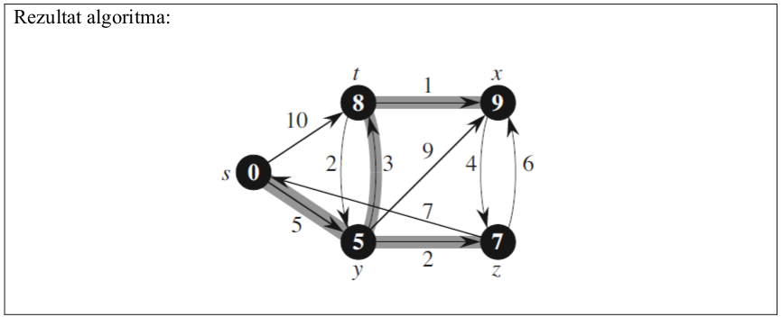




name: zadaci
name: uvod 
class: center, middle

# Zadaci

---
layout: true

.section[[Zadaci](#sadrzaj)]

---

## Zadatak 1 

.message.is-info[
.message-header[
Zadatak
]
.message-body[
- Implementirati graf prikazan na slici. 
- Izmeniti klasu `Vertex` tako da podrži definisanje težinksih koeficijenata na ivicama grafa. 
- Pored klase `Vertex` napraviti i klasu Edge koja predstavlja ivicu grafa. 
- Klasa `Edge` treba da sadrži barem `source, destination i weight` atribute.

]
]

---
## Zadatak 2

.message.is-info[
.message-header[
Zadatak
]
.message-body[
- Implementirati Dijkstrin algoritam za pronalaženje najkraće putanje grafa. 
- Pseudokodovi potrebnih funkcija su dati na slici 2. Kao ulazni graf koristiti graf sa slike 1. 

]
]

---
## Zadatak 2

.message.is-info[
.message-header[
Zadatak
]
.message-body[

- Pseudokod funkcija potrebnih za implmentaciju Dijkstrinog algoritma

]
]

---
## Zadatak 3

.message.is-info[
.message-header[
Zadatak
]
.message-body[
- Napraviti funkciju za nasumično generisanje usmerenog težinskog grafa. 
- Korišćenjem funkcije `PrintPath` (Vežba 7) ispisati sve putanje od čvora u ka svim ostalim čvorovima, i na osnovu toga skicirati dobijeni graf. 
- Čvor u takođe zabrati nasumično.

]
]

.message.is-success[
.message-header[
Odgovor
]
.message-body[
- <a target="_blank" rel="noopener noreferrer" href="../python-z10-resenja"> ☛ `Rešenja`</a>

]
]

