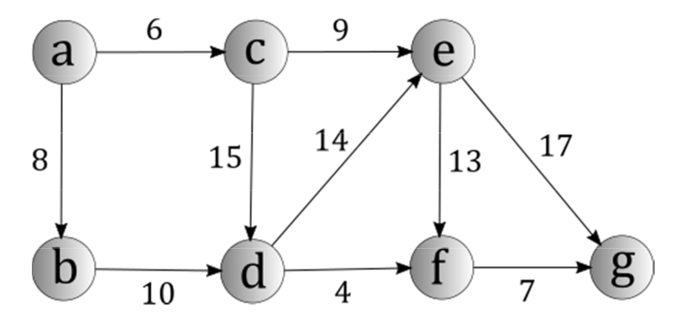




name: zadaci
name: uvod 
class: center, middle, inverse

# Zadaci

---
layout: true

.section[[Zadaci](#)]

---

## Zadatak 1 

.message.is-info[
.message-header[
Zadatak
]
.message-body[
- Napisati funkciju MakeGraph koja formira graf sa slike i vraća ga kao povratnu vrednost.
 `def MakeGraph() --> returns graph`

]
]

---
## Zadatak 2

.message.is-info[
.message-header[
Zadatak
]
.message-body[
- Napisati funkciju *GetInDegrees* i *GetOutDegrees* koje računaju ulazne i izlazne stepene (rangove) svakog čvora u grafu. 
- Povratna vrednost obe funkcije je lista stepena čvorova koji su raspoređeni u istom redosledu u kome se nalaze u ulaznom grafu. 
- `def GetInDegrees(graph) --> returns List`
- `def GetOutDegrees(graph) --> returns List`
]
]

---
## Zadatak 3

.message.is-info[
.message-header[
Zadatak
]
.message-body[
- Napisati funkciju *ShortestPath* koja računa najkraću putanju u datom grafu između dva čvora koja se
prosleđuju kao parametar. 
- Povratna vrednost je `par vrednosti (najkraća putanja, dužina)`. 
- Koristeći ovu funkciju izračunati najkraću putanju između čvorova A i G sa grafa sa slike iz zadatka (1). 
`def ShortestPath(graph, nodeA, nodeB) --> returns (List, int)`
]
]

---

## Zadatak 4

.message.is-info[
.message-header[
Zadatak
]
.message-body[
- Napisati funkciju *UpdateEdge* koja dodaje ivicu između dva čvora sa težinom koja se prosleđuje kao ulazni parametar.
- Ukoliko ivica već postoji između ta dva čvora, ova funkcija menja težinu date ivice. 
`def UpdateEdge(graph, nodeA, nodeB, weight) --> returns None`
]
]

---
## Zadatak 5

.message.is-info[
.message-header[
Zadatak
]
.message-body[
- Modifikovati graf napravljen u zadatku (1) koristeći funkciju iz zadatka (4) `dodajući ivicu od čvora B do čvora C sa težinom w(B,C)=-4`
- Napisati funkciju *NewShortestPath* koja računa najkraću putanju između čvorova A i G u ovom grafu. 
- (Funkcija nema parametre, koristiti globalnu promenljivu koja predstavlja modifikovan graf dobijen kao deo ovog zadatka) 
`def NewShortestPath() --> returns (List, int)`
]
]

--
.message.is-success[
.message-header[
Odgovor
]
.message-body[
- <a target="_blank" rel="noopener noreferrer" href="../python-z11-resenja"> ☛ `Rešenja`</a>
]
]

---

class: center, middle, theend, hide-text
layout: false
background-image: url(../theend.gif)

