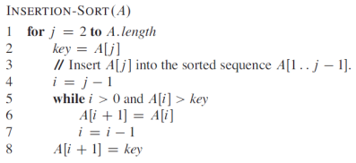




name: zadaci
name: uvod 
class: center, middle

# Zadaci

---
layout: true

.section[[Zadaci](#sadrzaj)]

---

## Zadatak 1 

- 1. Implementirati Insertion-sort algoritam, proveriti njegovu funkcionalnost i analizirati vreme izvršenja. Pseudokod algoritma je prikazan na slici.

---
## Zadaci 2, 3, 4

- Implementirati Bubble sort algoritam, proveriti njegovu funkcionalnost i analizirati vreme izvršenja. Ulazni podaci su niz (lista) brojeva i tražena vrednost. Izlaz je pozicija na kojoj se nalazi tražena vrednost.
- Implementirati algoritam za linearnu pretragu brojeva. Ulazni podaci su niz (lista) brojeva i tražena vrednost. Izlaz je pozicija na kojoj se nalazi tražena vrednost.
- Implementirati algoritam za binarnu pretragu brojeva. Ulazni podaci su niz (lista) brojeva i tražena vrednost. Izlaz je pozicija na kojoj se nalazi tražena vrednost.
---

## Napomene:

- Ulazni podaci su celobrojne vrednosti organizovane u listu.
- Funkcionalnost algoritma proveriti na malom broju ulaznih podatka.
- Tokom analize vremena izvršenja algoritma koristiti različite veličine ulaznih podataka.

- <a target="_blank" rel="noopener noreferrer" href="../python-z2-resenja"> ☛ `Rešenja`</a>

