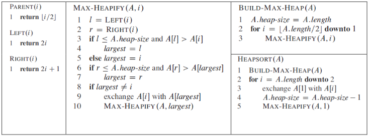
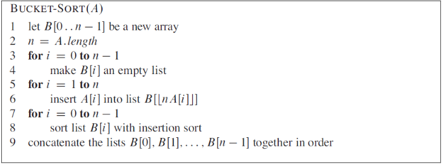
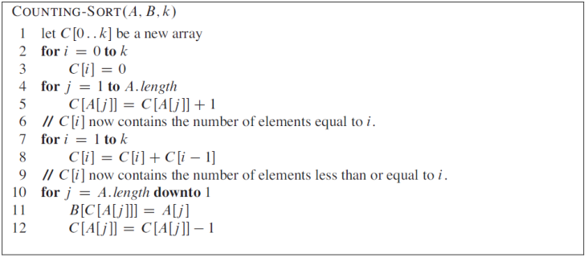




name: zadaci
name: uvod 
class: center, middle

# Zadaci

---
layout: true

.section[[Zadaci](#sadrzaj)]

---

## Zadatak 1

.message.is-info[
.message-header[
Zadatak
]
.message-body[
- Implementirati Heap-sort algoritam, proveriti njegovu funkcionalnost i analizirati vreme izvršenja. Pseudokodovi algoritma i pomoćnih funkcija su prikazani na slici.

]
]

---
## Zadatak 2

.message.is-info[
.message-header[
Zadatak
]
.message-body[
- Implementirati Bucket-sort algoritam, proveriti njegovu funkcionalnost i analizirati vreme izvršenja. Pseudokodovi algoritma i pomoćnih funkcija su prikazani na slici.

]
]

---
## Zadatak 3

.message.is-info[
.message-header[
Zadatak
]
.message-body[
- Implementirati Counting-sort algoritam, proveriti njegovu funkcionalnost i analizirati vreme izvršenja. Pseudokodovi algoritma i pomoćnih funkcija su prikazani na slici.

]
]

---
## Napomene 

.message.is-warning[
.message-header[
Info
]
.message-body[
- Ulazni podaci su celobrojne vrednosti organizovane u listu.
- Funkcionalnost algoritma proveriti na malom broju ulaznih podatka.
- Tokom analize vremena izvršenja algoritma koristiti različite veličine ulaznih podataka.
]
]

.message.is-success[
.message-header[
Odgovor
]
.message-body[

- <a target="_blank" rel="noopener noreferrer" href="../python-z4-resenja"> ☛ `Rešenja`</a>

]
]

