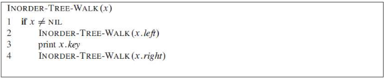
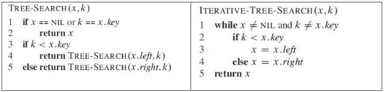
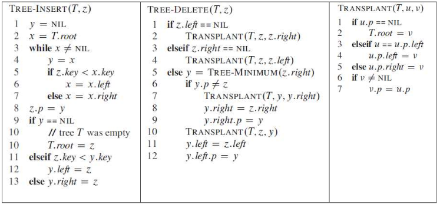




name: zadaci
name: uvod 
class: center, middle

# Zadaci

---
layout: true

.section[[Zadaci](#sadrzaj)]

---

## Zadatak 1 

- Koristeći primere priloženih klasa koje opisuju čvor binarnog stabla sa proizvoljnim podacima napraviti (ručno konstruisati) binarno stablo čiji podaci sadrže dva atributa:
    - celobrojnu vrednost i njenu odgovarajuću vrednost u znakovnom obliku. 
- Napraviti funkcije za dodavnje levog i desnog elementa proizvoljnom čvoru, kao i funkciju za ispis vrednosti proizvoljnog čvora.

---
## Zadatak 2 

- Implementirati `InorderTreeWalk` funkciju. . 
- Pseudokodovi funkcija su priloženi na slici.

---

## Zadatak 3

- mplementirati `SearchTree` i `IterativeTreeSearch` funkcije. 
- Pseudokodovi funkcija su priloženi na slici

---

## Zadatak 4

- Implementirati `TreeMinimum`, `TreeMaximum` i `TreeSuccessor` funkcije. 
- Pseudokodovi funkcija su priloženi na slici.

---

## Zadatak 5

- Implementirati `TreeInsert` i `TreeDelete` funkciju. 
- Pseudokodovi funkcija su priloženi na slici.

---

## Zadatak 6

- Napraviti proizvoljno dugačak niz slučajno generisanih celobrojnih vrednosti i iskoristiti ga kao ulaz za formiranje binarnog stabla. 
- Izmeniti `InorderTreeWalk` funkciju da umesto ispisa elemente dodaje u listu. 
- Slučajno generisani niz elemenata sortirati i proveriti rezultat. 
- Za sortiranje se preporučuje upotreba funkcionalno proverenog algoritma.

---

## Napomene:

- Proveriti funkcionalnost svih osnovnih funkcija.
- Za proveru osnovnih funkcija koristiti mali broj ulaznih podataka kako bi mogli ručno proveriti funkcionalnost i potvrditi ispravnost rada funkcije.

- <a target="_blank" rel="noopener noreferrer" href="../python-z5-resenja"> ☛ `Rešenja`</a>

