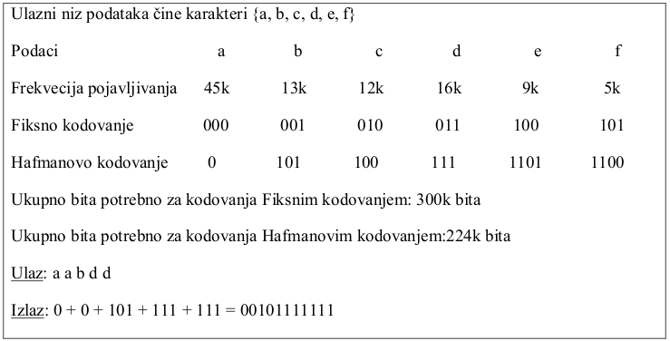




name: zadaci
name: uvod 
class: center, middle, inverse

# Zadaci

---
layout: true

.section[[Zadaci](#sadrzaj)]

---

## Uvod 

- Hafmanovo kodovanje se primenjuje kao tehnika za kompresiju podataka i veoma je efikasno, tipične uštede su od 20% do 80% zavisno od karakteristike podataka koji se kompresuju. 
- U našem primeru podaci su predstavljeni kao ulazni niz karaktera. 
- Hafmanovo kodovanje umesto kodnih reči fiksne veličine koristi kodne reči promenljive veličine koje se nazivaju Hafmanovi kodovi. 
- Hafmanovo kodovanje koristi informaciju o tome koliko često se svaki podatak na ulazu pojavljaje (frekvencija pojavljivanja) i na osnovu nje za svaki ulazni podatak bira optimalnu vrednost binarnog stringa.

---

## Uvod

- Odgovarajući kodovani izlaz se dobija prostim spajanjem binarnih vrednosti ulaznih podataka. 
- Primer je prikazan na slici Više na [https://en.wikipedia.org/wiki/Huffman_coding](https://en.wikipedia.org/wiki/Huffman_coding).

---
## Zadatak 1 

.message.is-info[
.message-header[
Zadatak
]
.message-body[
- Napisati funkciju `GetHistogram` koja na osnovu niza ulaznih podataka (karakteri) pravi histogram, tj. računa frekvenciju pojavljivanja određenog karaktera. 
- Podatak modelovati kao objekat koji ima najmanje dva atributa, `value` i `freq`, koji predstavljaju sam karakter i frekvenciju pojavljivanja konkretnog karaktera, respektivno. 
- Primeri ulaznih podataka dostupan je u `snippets.txt`.
]
]

---

## Zadatak 2

.message.is-info[
.message-header[
Zadatak
]
.message-body[
- Na osnovu histograma formirati Hafmanovo stablo prema sledećoj proceduri:
    - Svi elementi (karakteri) su listovi stabla.
    - Dva elementa sa najmanjom verovatnoćom pojavljivanja formiraju novi čvor čiji su potomci ta konkretna dva elementa. Novi čvor ulazi u histogram umesto ta 2 elementa, sa verovatnoćom jednakom zbiru njihovih verovatnoća.
    - Postupak se ponavlja dok se ne isprazni histogram, odnosno dok se ne formira kompletno stablo sa samo jednim elementom koji predstavlja koren.
]
]

--
.message.is-warning[
.message-header[
Info
]
.message-body[
- Obezbediti funkcije `GetMinFreqElem`, `MakeNewElem`, `PutElem` i `RemoveElem`.
]
]

---

## Zadatak 3 

.message.is-info[
.message-header[
Zadatak
]
.message-body[
- Koristeći formirano Hafman stablo kodovati primere dostupne u snippets.txt. 
- Hafmanov kod određenog karaktera formira se prostim spajanjem binarnih vrednosti (0 i 1) koje se nalaze na putanji do njegove pozicije u Hafman stablu. 
- Za svaki primer napraviti posebnu funkciju koja ispisuje ulazni niz podataka i dobijeni kodovani izlaz (ceo ulazni niz podataka i ceo kodovani izlaz).
]
]

--
.message.is-warning[
.message-header[
Info
]
.message-body[
- Obezbediti funkciju GetEncVal koja vraća kodovanu vrednost traženog
karaktera.
]
]

---

## Ilustracija formiranja Hafman stabla

--
.message.is-success[
.message-header[
Odgovor
]
.message-body[
- <a target="_blank" rel="noopener noreferrer" href="../python-z6-resenja"> ☛ `Rešenja`</a>

]
]

---

class: center, middle, theend, hide-text
layout: false
background-image: url(../theend.gif)

