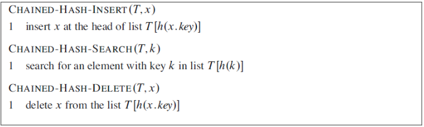
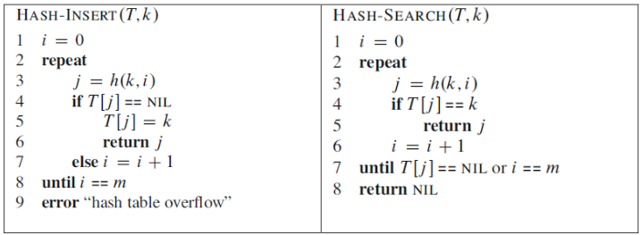




name: zadaci
name: uvod 
class: center, middle

# Zadaci

---
layout: true

.section[[Zadaci](#sadrzaj)]

---

## Zadatak 1

.message.is-info[
.message-header[
Zadatak
]
.message-body[
- Implementirati hash tabelu zasnovanu na rešavanju konflikata upotrebom pristupa ulančavanja (`chaining`). 
- Na slici u nastavku dati su pseudokodovi funkcija za rukovanje hash tabelom. 
- Elemente tabele (podatke) predstaviti kao objekat klase Data koja ima bar dva atributa: `key` i `literal`. 
- Atribut `key` predstavlja celobrojnu vrednost koja se koristi kao argument u hash funkciji, dok atribut `literal` predstavlja znakovnu vrednost atributa `key`.
]
]

---
## Zadatak 1

.message.is-info[
.message-header[
Zadatak
]
.message-body[
- Za pravljenje `hash` funkcije (h), odnosno za rešavanje koflikata, koristiti sledeće pristupe:
- Metod deljenja (*The division method*)

$$ h(k)= k\quad mod\quad  m\\ k - vrednost\quad kljuca \\ m- broj\quad mesta (slotova)\quad za \quad smestanje\quad elementata $$
  

- Metod množenja (*The multiplication method*)

$$ h(k)= floor(m(kA\quad mod\quad 1))\\ A\sim\frac{(\sqrt{5}-1)}{2}=0.6180339887... \\ A – Optimalna\quad konstana (Knuth) $$
  

]
]

---
## Zadatak 1

.message.is-info[
.message-header[
Zadatak
]
.message-body[
- Univerzalno heširanje (*Universal hashing*)

$$ h_{ab}(k)=((ak+b)mod \quad p)mod \quad m  $$
  

- p – prost broj dovoljno velik da obuhvata sve vrednosti ključeva k
 $$ k \in Z_{p} $$

- a, b – slučajno izabrani brojevi na početku izvršavanja

$$ a \in {Z_{p}}^\star \quad b \in {Z_{p}} \\ {Z_{p}}=\left\{0,1,2,...,p-1\right\}\\{Z_{p}}^\star=\left\{1,2,...,p-1\right\}\\ $$
  

]
]

---

## Zadatak 1

.message.is-info[
.message-header[
Zadatak
]
.message-body[
- Pseudokod funkcija za rukovanje hash tabelom (*chaining*)

]
]

---
## Zadatak 1

.message.is-info[
.message-header[
Zadatak
]
.message-body[
- Izmeriti (i) vreme formiranja (punjenja) hash tabele i (ii) vreme pretrage slučajno odabranog broja iz ulaznog skupa. 
- Za eksperiment koristiti sledeće kombinacije parametara:
    - n = 10, 50 i 100 hiljada slučajno generisanih ulaznih brojeva (key vrednosti) u opsegu [0, p-1],
    - za n = 10, 50 i 100 hiljada ulaznih elemenata koristiti proste brojeve p = 23, 9973 i 99991, respektivno,
    - koristiti različite veličine hash tabele, m = p, p/2 i p/4.
]
]

.message.is-warning[
.message-header[
Info
]
.message-body[
- Prilikom formiranja `hash` tabele voditi računa o tome da se već postojeći podaci u tabeli ažuriraju, odnosno, pre ubacivanja podatka sa ključem `key` treba proveriti da li taj ključ već postoji u `hash` tabeli.
]
]

---
## Zadatak 2

.message.is-info[
.message-header[
Zadatak
]
.message-body[
- Implementirati `hash` tabelu zasnovanu na rešavanju konflikata upotrebom pristupa otvorenog adresiranja (*open addressing*). 
- Pseudokodovi funkcija za rukovanje `hash` tabelom dati su na slici u nastavku. 
- Elemente `hash` tabele predstaviti kao u prethodnom zadatku.

a. Linearna provera (Linear probing)

$$ h(k, i) = (h’(k) + i) mod \quad m $$

- h’ – pomoćna hash funkcija
- k – vrednost ključa
- m – broj mesta (slotova) za smeštanje elemenata
- i – pokušaj provere; i ∈ {0, 1, 2, ..., m-1}
]
]

---

## Zadatak 2

.message.is-info[
.message-header[
Zadatak
]
.message-body[
b. Kvadratna provera (*Quadratic probing*)

$$ h(k, i) = (h’(k) + c_1 i+ c_2 i^2 ) mod \quad m $$
$$ c_1 \quad i \quad c_2 – konstante $$
c. Dvostruko heširanje (*Double hashing*)
$$ h(k, i) = (h_1 (k) + h_2 (k)) mod \quad m $$
$$ h_1 \quad i \quad h_2 – pomocne \quad hash \quad funkcije $$
]
]

---

## Zadatak 2

.message.is-info[
.message-header[
Zadatak
]
.message-body[
- Izmeriti (i) vreme formiranja (punjenja) hash tabele i (ii) vreme pretrage slučajno odabranog broja iz ulaznog skupa. 
- Za eksperiment koristiti sledeće kombinacije parametara:
    - n = 10, 50 i 100 hiljada slučajno generisanih ulaznih brojeva (key vrednosti),
    - konstante $$c_1 = c_2 = \frac{1}{2} $$
    - pomoćne funkcije h1 i h2 :
    - h1 (k) = k mod m 
    - h2 (k) = 1 + (k mod m’); m’ <= m-1 
- koristiti različite veličine hash tabele, m = n, n/2 i n/4.
]
]

---

## Zadatak 2

.message.is-warning[
.message-header[
Info
]
.message-body[
- Prilikom formiranja `hash` tabele voditi računa o tome da se već postojeći podaci u tabeli ažuriraju, odnosno pre ubacivanja podatka sa ključem `key` treba proveriti da li taj ključ već postoji u `hash` tabeli.

]
]

.message.is-success[
.message-header[
Odgovor
]
.message-body[
- <a target="_blank" rel="noopener noreferrer" href="../python-z7-resenja"> ☛ `Rešenja`</a>
]
]

