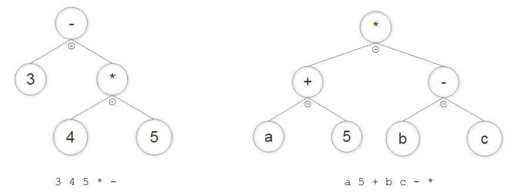




name: test
name: uvod 
class: center, middle, inverse

# Test

---
layout: true

.section[[Test](#sadrzaj)]

---

## Test 

.message.is-info[
.message-header[
Zadatak
]
.message-body[
- Obrnuta poljska notacija (Reverse Polish notation), poznatija i kao postfiksna notacija je matematička notacija izraza u kojoj operatori prate oba operanda. 
- Postfiksna notacija se formira tako što se navede: 
  1. ceo podizraz koji predstavlja prvi operand, u postfiksnoj notaciji; 
  2. ceo podizraz koji predstavlja drugi operand, u postfiksnoj notaciji; 
  3. operator.
]
]

--
.message.is-warning[
.message-header[
Info
]
.message-body[
- Ne treba proveravati validnost ulaznih parametara za funkcije. 
- Smatrati da de ulazni parametar uvek pratiti specifikaciju funkcije.
]
]

---
## Test

- Na primer, izraz:

4 5 +
- u postfiksnoj notaciji predstavlja isto što i izraz
4 + 5
- u infiksnoj notaciji na koju smo navikli. 
- Bez obzira na to, postfiksna notacija je lakša za parsiranje i evaluaciju jer ne zahteva zagrade pošto je uvek nedvosmisleno jasno na koja dva operanda ili podizraza se odnosi dati operator.
- Evaluaciju izraza u postfiksnoj notaciji možemo posmatrati kroz slededi složeniji izraz:
    - 3 4 5 `*` - raščlanjeno na delove: (3) (4 5 `*`) (-)

---
## Test 

- Ovde je nedvosmisleno jasno da se operator `*` odnosi na operande 4 i 5, a operator – na operand 3 i vrednost pod-izraza 4`*`5. 
- Ovo je nedvosmisleno jer se operator uvek odnosi na dva elementa koja mu prethode, bilo da su to brojevi ili podizrazi. 
- Infiksna predstava ovog izraza je:
    - 3 – (4 `*` 5)
- U nastavku je još jedan primer koji pomaže u razumevanju postfiksne notacije:
    - POSTFIX: a 5 + b c - `*`
    - INFIX: (a + 5) `*` (b – c)

---
## Test 

- Vaš zadatak je da napravite parser izraza datog kao tekst, u kome su pojedini elementi odvojeni praznim mestima, tj. karakterom space. 
- Parser treba da razume izraz u postfiksnoj notaciji, može da izračuna njegovu vrednost i prikaže ga u infiksnoj notaciji radi lakšeg razumevanja od strane korisnika.
- Elementi izraza mogu biti:
    - Nenegativni celi brojevi
    - Reč koja predstavlja promenljivu
    - Karakteri + - `*` / koji predstavljaju četiri podržane operacije.

---
## Test

- Parser treba zasnovati na `binarnom stablu` koji predstavlja izraz tako što se u čvoru nalazi operator, a levo i desno dete tog čvora su operandi koji mogu biti ili konačna vrednost (broj ili promenljiva) ili novi podizraz predstavljen podstablom. 
- Primeri stabla izraza su dati na narednim slikama:



---
## Test

- Napisati funkciju `get_parse_tree(s)` koja prihvata string s koji predstavlja izraz u postfiksnoj notaciji. Pojedini elementi izraza se u ovom stringu odvajaju praznim mestima, tj. karakterom space. Funkcija treba da vrati `binarno stablo` koje predstavlja dati izraz.
- Napisati funkciju `eval_tree(tree, dictionary)` koja prihvata: binarno stablo izraza i rečnik u kome se nalaze vrednosti svih promenljivih u izrazu. Ključevi rečnika su imena promenljivih, a uz svaki ključ je navedena vrednost date promenljive koja se koristi prilikom evaluacije izraza. Funkcija treba da vrati vrednost izraza predstavljenog binarnim stablom.
- Napisati funkciju `make_infix(tree)` koja prihvata binarno stablo izraza i formira infiksnu predstavu tog izraza. Funkcija treba da vrati `string` koji predstavlja infiksnu predstavu izraza. Svaki podizraz u infiksnoj notaciji treba biti odvojen zagradom od ostatka izraza.

---

## Test

- Primeri testnih slučajeva:

```sh
INPUT STRING: "23 45 67 + -"
EVAL_TREE RETURNS: -89
MAKE_INFIX RETURNS: (23 - (45 + 67))

INPUT STRING: "a 5 + b c 3 / - *"
VARIABLE DICTIONARY: {'a': 34, 'b': 65, 'c': 3}
EVAL_TREE RETURNS: 2496
MAKE_INFIX RETURNS: ((a + 5) * (b - (c / 3)))

INPUT STRING: "vel_0 time * g time * time 2 / * +"
VARIABLE DICTIONARY: {'vel_0': -10, 'time': 20, 'g': 9.81}
EVAL_TREE RETURNS: 1762.0
MAKE_INFIX RETURNS: ((vel_0 * time) + ((g * time) * (time / 2)))
```

---
## Test

.message.is-info[
.message-header[
Dodatni zadatak
]
.message-body[
- Proširiti parser tako da podržava i `negativne cele brojeve` kao deo izraza u postfiksnoj notaciji. 
- Minimalno omoguditi sledede:
    - Razumevanje izraza koji koriste negativne cele brojeve kao elementarne vrednosti u izrazu;
    - Ispis odgovarajude infiksne notacije tako da negativni broj bude odvojen svojom zagradom od ostatka izraza.
]
]

--
.message.is-dark[
.message-header[
Primer testnog slučaja:
]
.message-body[
```sh
INPUT STRING: "-3 -5 – 1 +"
EVAL_TREE RETURNS: 3
MAKE_INFIX RETURNS: (((-3) – (-5)) + 1)
```
]
]

--
.message.is-success[
.message-header[
Odgovor
]
.message-body[
- <a target="_blank" rel="noopener noreferrer" href="../python-z8-resenja"> ☛ `Rešenja`</a>

]
]

---

class: center, middle, theend, hide-text
layout: false
background-image: url(../theend.gif)

