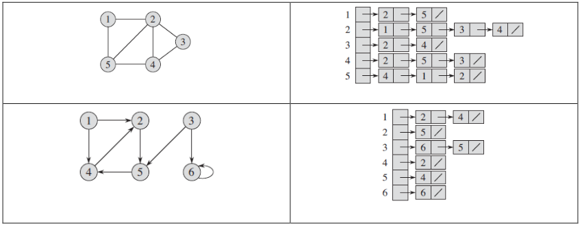
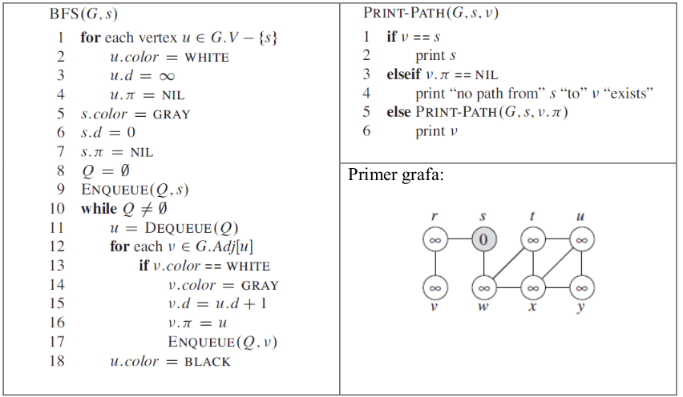
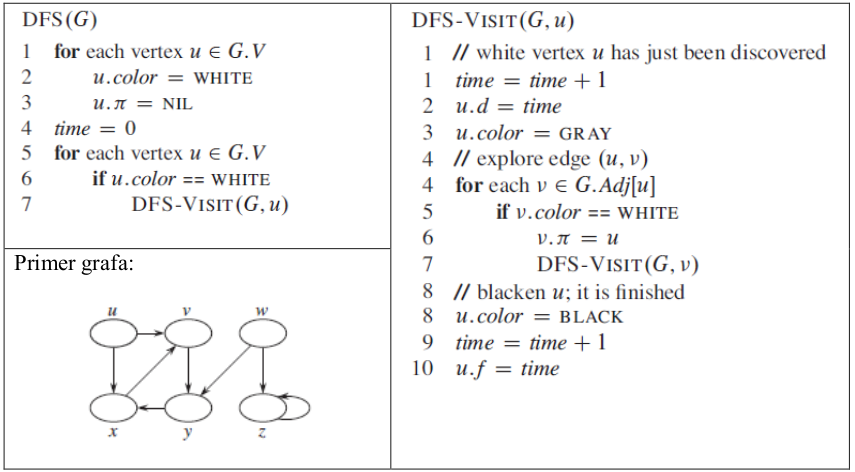
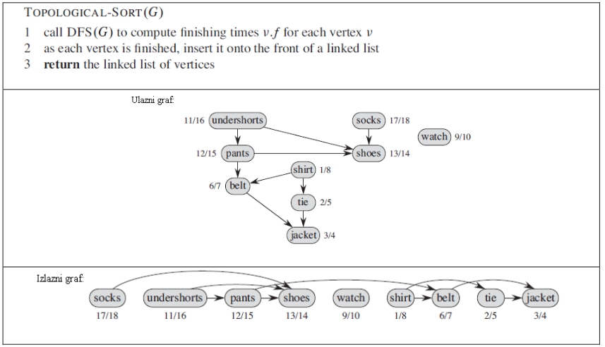




name: zadaci
name: uvod 
class: center, middle

# Zadaci

---
layout: true
.section[[Zadaci](#sadrzaj)]

---

## Zadatak 1 

- Implementirati grafove prikazane na slici 1. Graf predstaviti korišćenjem reprezentacije susednih lista čvorova (*adjacency-list representation*) koja je takoĎe prikazana na slici.
- Čvor grafa predstaviti po uzoru na priloženi šablon. 
- Napisati funkcije za (i) ispis svih susednih čvorova v čvora u i (ii) ispis svih veza čvora u i susednih čvorova v.

---
## Zadatak 2

- Implementirati pretragu grafa po širini (*Breadth-first search*). 
- Za proveru funkcionalnosti iskoristiti graf sa slike. 

---
## Zadatak 3

- Implementirati pretragu grafa po dubini (*Depth-first search*). 
- Za proveru funkcionalnosti iskoristiti graf sa slike.

---
## Zadatak 4 <a target="_blank" rel="noopener noreferrer" href="../python-z9-resenja"> ☛ `Rešenja`</a>

- Koristeći pretragu grafa po dubini implementirati topološki sort algoritam čiji je pseudokod prikazan na slici.

